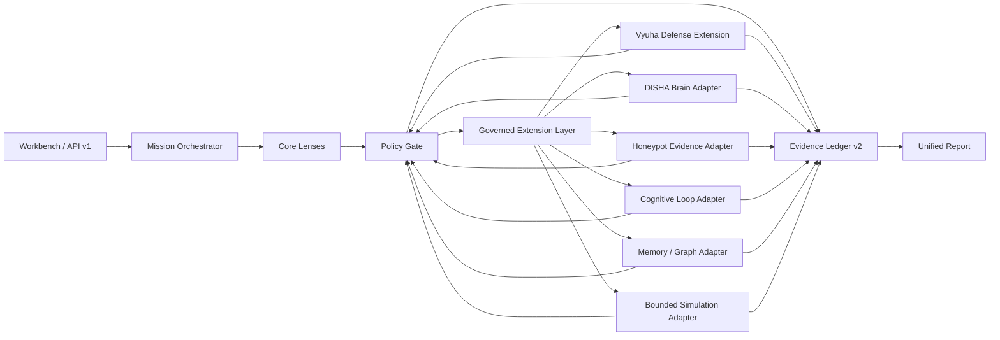
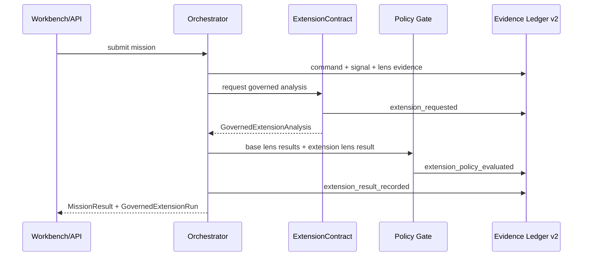

# DISHA 6.6 Architecture

DISHA 6.6 is the Constitutional Evidence Operating System: a governed intelligence runtime where every conclusion must show its evidence chain and every system path remains accountable to the citizen.

This file is the repository's single source of truth for architecture. Older architecture notes are retained only as historical material under `docs/archive/`.

## Architecture Rule

DISHA presents as one system. Internally, it has a governed core and a governed extension layer.

```text
User/API/Workbench -> Governed Intelligence Core -> Governed Extension Layer -> Policy -> Evidence
```

Nothing becomes product behavior until it passes:

```text
contract -> policy -> evidence -> test
```

## Unified Runtime

From the outside, DISHA is a single Constitutional Evidence Operating System. Users submit missions through the Workbench or API and receive one policy-gated, evidence-backed result.

Internally, DISHA keeps a strict boundary:

- Core capabilities live in `web/lib/unified/`.
- Advanced capabilities enter through `web/lib/extensions/`.
- Research/source material remains in `disha/` or `skills/` until promoted through an extension adapter.



## Governed Intelligence Core

Location:

- `web/`
- `web/lib/unified/`

Status:

- Active production spine.
- The only default runtime surface.
- The only layer that may produce policy decisions, evidence events, API responses, and user-facing mission outputs.

Responsibilities:

- Type contracts for signals, lenses, policy decisions, evidence events, and source records.
- Mission orchestration.
- Deny-by-default policy evaluation.
- Evidence Ledger v2.
- Source registry and source admission.
- API routes under `web/app/api/v1/`.
- The `/workbench` constitutional intelligence flow.
- Tests proving contract, policy, evidence, and API behavior.

Key files:

| Path | Responsibility |
| --- | --- |
| `web/lib/unified/contracts.ts` | Product contracts and shared types |
| `web/lib/unified/orchestrator.ts` | Signal normalization, routing, fusion, and mission orchestration |
| `web/lib/unified/policy-gate.ts` | Deny-by-default policy decisions |
| `web/lib/unified/evidence-ledger.ts` | Persistent tamper-evident ledger behavior |
| `web/lib/unified/source-registry.ts` | Public/official source definitions and probes |
| `web/app/api/v1/` | Versioned production API surface |
| `web/app/workbench/` | Interactive mission workbench |
| `web/tests/` | Product-spine tests |

Layer 1 may read from approved external sources and optional services only through typed contracts, policy gates, source provenance, and tests. Model output is advisory; it is not a source of fact.

## Governed Extension Layer

Location:

- `web/lib/extensions/`

Status:

- Active bridge for advanced capabilities.
- Native to the user-facing DISHA experience.
- Not a bypass around core governance.

Responsibilities:

- Define `ExtensionContract` / `GovernedExtension` contracts.
- Define `EvidenceEmitter` lifecycle emission.
- Define an optional governed research runtime JSON contract for Brain, Cognitive Loop, and Memory/Graph services.
- Convert advanced capability output into typed proposals and evidence-backed analysis.
- Re-run Policy Gate evaluation for extension outputs.
- Append extension request, policy, and result events to Evidence Ledger v2.
- Return extension results as part of the unified mission response.

Lifecycle:



Active first-class extensions:

| Extension | Source | Status |
| --- | --- | --- |
| Vyuha Defense Engine | `skills/vyuha-defense-engine/` | Defensive proposal adapter active in `web/lib/extensions/vyuha-defense.ts` |
| DISHA Brain | `disha/brain/` | Read-only graph/orchestration adapter active in `web/lib/extensions/disha-brain.ts` |
| Cognitive Engine and Loop | `disha/ai/core/cognitive_loop.py`, `disha/ai/agents/` | Read-only phase adapter active in `web/lib/extensions/cognitive-engine.ts` |
| Memory and Graph Knowledge | `disha/brain/memory/`, `disha/brain/graph/`, `disha/ai/core/memory/` | Source-hash-bound context adapter active in `web/lib/extensions/memory-graph.ts` |
| Honeypot Evidence Intake | `disha/services/cyber/honeypot/`, Vyuha honeypot proposals | Owned telemetry intake adapter active in `web/lib/extensions/honeypot-evidence.ts` |
| Quantum and Physics Simulation | `disha/ai/physics/`, `disha/ai/models/physics_engine/`, `disha/ai/models/simulation/` | Bounded simulation request adapter active in `web/lib/extensions/physics-simulation.ts` |

Extension validation:

- Extension output must match its registered contract ID and title.
- Extension output must include at least one finding and one evidence item.
- Proposed actions must be mirrored as `DishaLensResult.recommendedActions`.
- Defensive posture must match the manifest.
- The runner records a lifecycle trace: `request`, `policy_evaluation`, and `result_record`.

Optional research runtime:

- Environment: `DISHA_RESEARCH_RUNTIME_URL`.
- Health endpoint: `GET /api/v1/extensions/runtime/health`.
- Runtime contract endpoint expected by DISHA: `POST /governed/analyze`.
- Contract version: `disha.research-runtime.v1`.
- Mode: `read_only`.
- Required constraints: no external actions, no state mutation, source hashes required, bounded runtime.
- If unavailable, adapters continue with repository-bound evidence and report the runtime limitation. They do not fail open.

The extension catalog is exposed at:

```text
GET /api/v1/extensions
```

Extension rule:

```text
extension source -> adapter contract -> policy gate -> evidence ledger -> unified mission result
```

## Sovereign Cognitive Source Material

Location:

- `disha/`
- `skills/vyuha-defense-engine/`

Status:

- Research/source layer.
- Disabled from the default product path.
- Used only through governed adapters or Docker `--profile full` where applicable.

Responsibilities:

- Experimental cognitive, cyber, physics, integration, and service modules.
- Research prototypes that may later be promoted into Layer 1.
- Optional local services for experimentation.

Boundary rule:

- Source material cannot directly influence user-facing conclusions, policy decisions, or evidence records.
- A capability can be promoted only by adding a governed extension adapter, policy evaluation, evidence logging, tests, and documentation.

## Documentation Layout

| Path | Purpose |
| --- | --- |
| `ARCHITECTURE.md` | Authoritative architecture source |
| `README.md` | Public repository introduction and runbook |
| `CONTRIBUTING.md` | Contribution policy and review standard |
| `docs/public/` | GitHub Pages published public material only |
| `docs/internal/` | Internal release notes, baselines, and maintainer checklists |
| `docs/archive/` | Historical or outdated material retained for reference |

Do not add new architecture documents outside this file. If supporting diagrams are needed, place them in `docs/internal/` and link back here as the source of truth.

## Docker Modes

Default local development:

```bash
docker compose up --build web
```

This starts Layer 1 and its data services only.

Full research stack:

```bash
docker compose --profile full up --build
```

This includes Layer 2 services from `disha/`.

Production compose:

```bash
docker compose -f docker-compose.prod.yml up
```

Production compose runs the governed web spine. Research services are not part of the production default.

## Security Posture

DISHA defaults to restraint:

- Deny unsafe actions unless explicitly allowed by policy.
- Treat unsupported claims as `[VERIFY REQUIRED]`.
- Keep model responses advisory.
- Record provenance in evidence events.
- Require authentication, validation, rate limiting, and tests for production APIs.
- Never commit secrets, private data, leaked credentials, or controlled records.

## Promotion Checklist

Any new capability must answer yes to every item:

- Is there a Layer 1 contract?
- Is the policy behavior explicit?
- Is the evidence trail written and testable?
- If advanced, does it enter through `web/lib/extensions/`?
- Are public claims sourced or marked `[VERIFY REQUIRED]`?
- Are auth, validation, rate limiting, and errors handled?
- Are tests present in `web/tests/` or an equivalent product-spine test path?
- Is the documentation updated without creating another architecture source of truth?

If any answer is no, the capability remains research or internal material.
