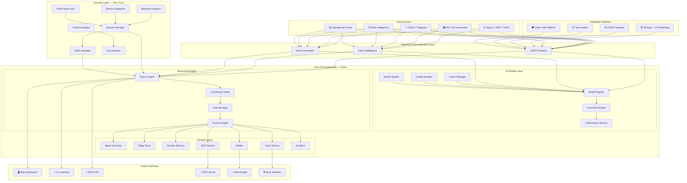
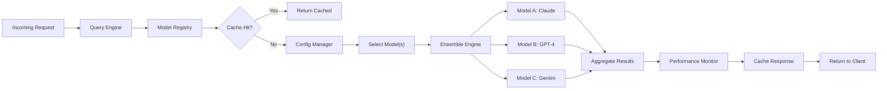
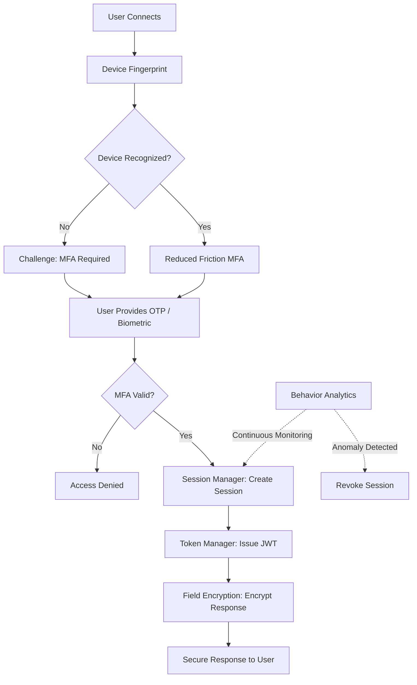
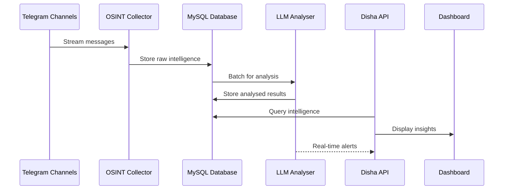
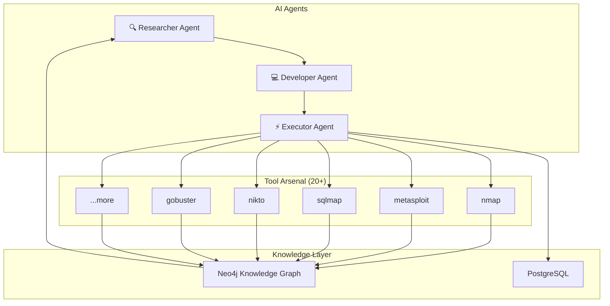
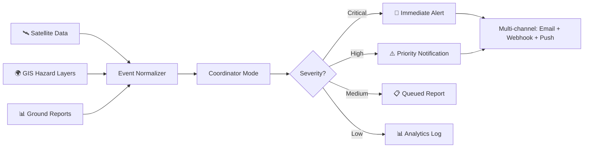
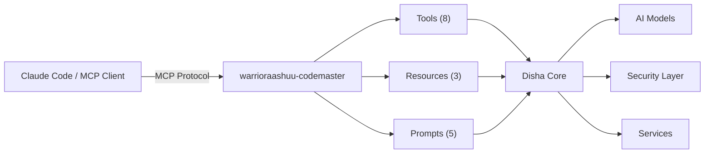
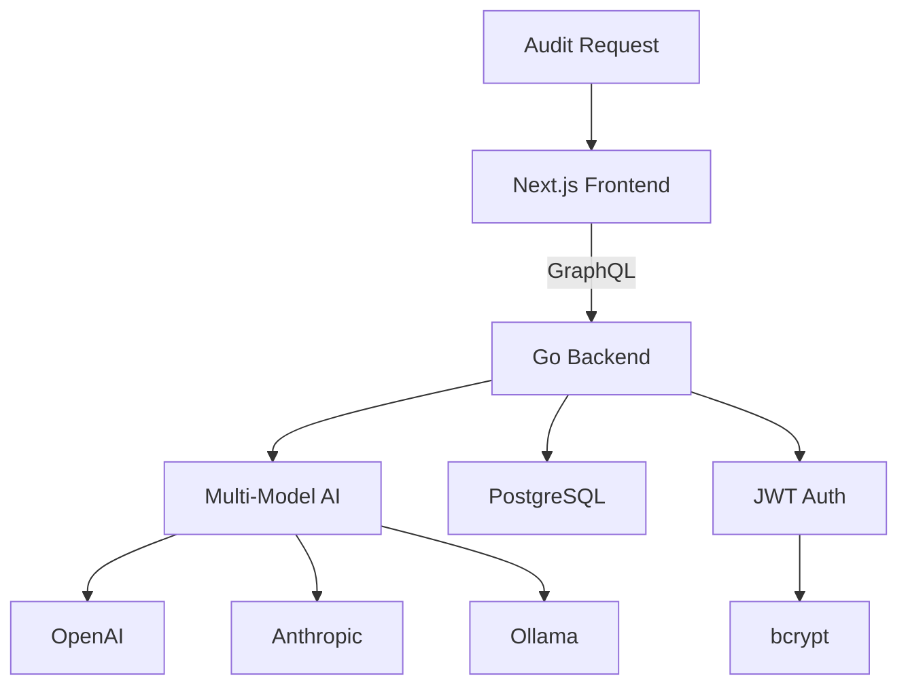
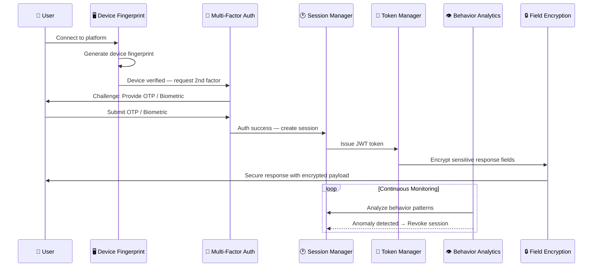
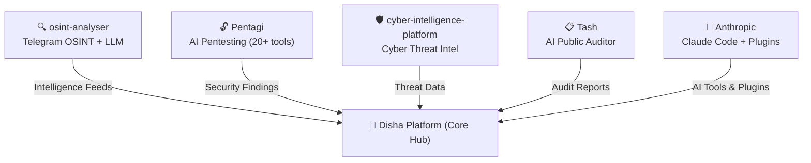

<div align="center">

# 🧭 Disha — Unified AI Intelligence & Security Platform

[](https://www.typescriptlang.org/)
[](https://nodejs.org/)
[](https://bun.sh/)
[](https://www.docker.com/)
[](LICENSE)
[](CONTRIBUTING.md)

**The world's first open-source platform combining AI Orchestration, OSINT, Penetration Testing, Disaster Intelligence, Zero Trust Security, and MCP — all in one.**

Built by [**Tashima-Tarsh**](https://github.com/Tashima-Tarsh)

</div>

---

## 📑 Table of Contents

- [What is Disha?](#-what-is-disha)
- [Why Disha is Unique](#-why-disha-is-unique)
- [Architecture Overview](#️-architecture-overview)
- [Platform Modules](#-platform-modules)
  - [Module 1: AI Orchestration Engine](#module-1--ai-orchestration-engine)
  - [Module 2: Zero Trust Security](#module-2--zero-trust-security)
  - [Module 3: OSINT Intelligence](#module-3-️-osint-intelligence)
  - [Module 4: AI Penetration Testing (Pentagi)](#module-4--ai-penetration-testing-pentagi)
  - [Module 5: Disaster Intelligence & GIS](#module-5--disaster-intelligence--gis)
  - [Module 6: MCP Server](#module-6--mcp-server)
  - [Module 7: Voice Interface](#module-7-️-voice-interface)
  - [Module 8: AI Auditing (Tash)](#module-8--ai-auditing-tash)
- [Full Repository Structure](#-full-repository-structure)
- [Quick Start](#-quick-start)
- [Configuration & Environment Variables](#️-configuration--environment-variables)
- [Security Architecture (Zero Trust)](#️-security-architecture-zero-trust)
- [Integrated Repositories](#-integrated-repositories)
- [Tech Stack](#-tech-stack)
- [Roadmap](#️-roadmap)
- [Contributing](#-contributing)
- [License](#-license)
- [Acknowledgements](#-acknowledgements)

---

## 🧭 What is Disha?

**Disha** (दिशा) is a Hindi word meaning **"Direction"** — and that is exactly what this platform provides: a unified direction for AI-powered intelligence, security, and disaster response.

Disha was created because no single open-source platform existed that combined **AI orchestration**, **OSINT collection**, **penetration testing**, **disaster early-warning systems**, **zero-trust security**, and **model context protocol (MCP)** into a cohesive, production-ready stack. Organizations and researchers had to stitch together dozens of separate tools — each with its own configuration, data format, and deployment model — to achieve what Disha delivers out of the box.

Disha solves this fragmentation problem by providing a **modular, extensible platform** where every capability — from multi-model AI inference to real-time threat intelligence — is orchestrated through a single reasoning engine. Whether you are a security analyst monitoring OSINT feeds, a disaster-response coordinator tracking geospatial hazards, or a developer building AI-powered applications with Claude Code via MCP, Disha provides the infrastructure, the intelligence layer, and the security backbone to get it done.

---

## 🌍 Why Disha is Unique

No single platform before Disha has unified all of these capabilities. Here is how Disha compares to existing tools:

| Feature | Disha | PentAGI | CAI | ODET | Kestra |
|---|:---:|:---:|:---:|:---:|:---:|
| Multi-model AI Orchestration | ✅ | ❌ | ✅ | ❌ | ✅ |
| OSINT Collection & Analysis | ✅ | ❌ | ✅ | ✅ | ❌ |
| AI Penetration Testing | ✅ | ✅ | ✅ | ❌ | ❌ |
| Disaster Early Warning | ✅ | ❌ | ❌ | ✅ | ❌ |
| Zero Trust Security | ✅ | ❌ | ❌ | ❌ | ❌ |
| MCP Server Integration | ✅ | ❌ | ❌ | ❌ | ❌ |
| GIS / Geospatial Analysis | ✅ | ❌ | ❌ | ✅ | ❌ |
| AI Auditing | ✅ | ❌ | ❌ | ❌ | ❌ |
| Voice Interface | ✅ | ❌ | ❌ | ❌ | ❌ |
| Open Source | ✅ | ✅ | ✅ | ✅ | ✅ |

> **Disha is the first known open-source platform to combine all 10 capabilities in a single repository.**

---

## 🏗️ Architecture Overview

The following diagram shows how every layer of the Disha platform connects — from data sources through AI orchestration, security, and output interfaces.



---

## 🧩 Platform Modules

Disha is composed of **eight core modules**, each responsible for a distinct domain of intelligence, security, or infrastructure.

---

### Module 1: 🤖 AI Orchestration Engine

> **Location:** `src/ai-models/`

The AI Orchestration Engine is Disha's brain. It manages multiple AI models (Claude, GPT-4, Gemini, Ollama) through a unified interface, routing requests to the best model for a given task and aggregating results through ensemble reasoning.

**Sub-modules:**

| Sub-module | Directory | Purpose |
|---|---|---|
| Model Registry | `src/ai-models/registry/` | Central catalog of all available AI models and their capabilities |
| Ensemble Engine | `src/ai-models/ensemble/` | Combines outputs from multiple models for higher accuracy |
| Cache Manager | `src/ai-models/cache/` | Caches model responses to reduce latency and API costs |
| Config Manager | `src/ai-models/config/` | Manages model-specific configurations and parameters |
| Performance Monitor | `src/ai-models/performance/` | Tracks response times, token usage, and throughput metrics |
| Monitoring | `src/ai-models/monitoring/` | Real-time health checks and availability monitoring |
| Model Updater | `src/ai-models/updater/` | Hot-swaps model versions without downtime |
| Interface | `src/ai-models/interface/` | Unified API interface for all model interactions |
| Types | `src/ai-models/types.ts` | Shared TypeScript type definitions for the AI layer |

**How a request flows through the AI Engine:**



---

### Module 2: 🔐 Zero Trust Security

> **Location:** `src/security/`

Disha implements a **Zero Trust Architecture** where no request is inherently trusted — every access is verified, every session is monitored, and every sensitive field is encrypted at rest.

**Authentication (`src/security/auth/`):**

| File | Purpose |
|---|---|
| `behavior-analytics.ts` | Detects anomalous user behavior patterns (unusual login times, geographic anomalies, rapid-fire requests) and triggers automatic session revocation |
| `device-fingerprint.ts` | Creates a unique fingerprint for each device using browser attributes, hardware specs, and network characteristics |
| `multi-factor-auth.ts` | Implements TOTP-based multi-factor authentication with backup codes and biometric support |
| `session-manager.ts` | Manages the full session lifecycle — creation, validation, renewal, and revocation |
| `token-manager.ts` | Issues, validates, and refreshes JWT tokens with configurable expiration and rotation |

**Encryption (`src/security/encryption/`):**

| File | Purpose |
|---|---|
| `field-encryption.ts` | Encrypts individual data fields using AES-256, allowing column-level encryption in databases |
| `key-rotation.ts` | Automatically rotates encryption keys on a configurable schedule without data re-encryption downtime |

**Zero Trust Auth Flow:**



---

### Module 3: 🕵️ OSINT Intelligence

> **Source:** [`osint-analyser`](https://github.com/Tashima-Tarsh/osint-analyser) repository

The OSINT Intelligence module collects open-source intelligence from Telegram channels and other sources, stores it in a structured MySQL database, and uses LLMs to automatically analyze, summarize, and categorize collected data.

**Capabilities:**
- 📡 Real-time collection from Telegram channels (conflict monitoring, geopolitical events)
- 🧠 LLM-powered auto-analysis of collected text (threat assessment, sentiment, entity extraction)
- 🗃️ Structured storage in MySQL for querying and reporting
- 🐳 Fully Dockerized — spin up with `docker compose up`

**OSINT Data Flow:**



---

### Module 4: 🔓 AI Penetration Testing (Pentagi)

> **Source:** [`Pentagi`](https://github.com/Tashima-Tarsh/Pentagi) repository

PentAGI (Penetration Testing Artificial General Intelligence) is a fully autonomous security testing platform that uses a multi-agent AI system to discover, exploit, and report vulnerabilities.

**Capabilities:**
- 🤖 Multi-agent AI system (Researcher, Developer, Executor agents)
- 🔧 20+ professional pentesting tools (nmap, metasploit, sqlmap, nikto, and more)
- 🧠 Knowledge graph (Neo4j + Graphiti) for persistent attack memory
- 📊 Grafana / Prometheus monitoring dashboards
- 🌐 REST + GraphQL APIs for automation

**Tech Stack:** Go (backend), React + TypeScript (frontend), PostgreSQL, Docker

**Pentagi Architecture:**



---

### Module 5: 🌍 Disaster Intelligence & GIS

> **Location:** `src/services/`, `src/coordinator/`

The Disaster Intelligence module provides geospatial hazard analysis, early-warning decision support, and event-driven alert routing — with special focus on India (ISRO/NASA context).

**Capabilities:**
- 🛰️ ISRO/NASA satellite data context for environmental monitoring
- 🗺️ Geospatial hazard layers (floods, earthquakes, cyclones, wildfires)
- 🚨 Policy-based severity classification and alert routing
- 📍 Region/state/city-oriented response templates
- 👥 Coordination-ready output for emergency teams

**Alert Routing Flow:**



---

### Module 6: 🔌 MCP Server

> **Location:** `mcp-server/`  
> **Package:** [`warrioraashuu-codemaster`](https://www.npmjs.com/package/warrioraashuu-codemaster) (v1.1.0)

The MCP (Model Context Protocol) Server enables Claude Code and other MCP-compatible clients to explore, query, and interact with the Disha platform programmatically.

**Transport Options:**
| Transport | File | Use Case |
|---|---|---|
| STDIO | `src/index.ts` | Local CLI integration |
| HTTP | `src/http.ts` | REST-style remote access |
| SSE | `src/http.ts` | Server-Sent Events for streaming |

**Key Files:**

| File | Purpose |
|---|---|
| `mcp-server/src/server.ts` | Core MCP server — registers all tools, resources, and prompts |
| `mcp-server/src/index.ts` | STDIO transport entry point |
| `mcp-server/src/http.ts` | HTTP + SSE transport entry point |

**MCP Integration:**



---

### Module 7: 🎙️ Voice Interface

> **Location:** `src/services/voice.ts`, `src/services/voiceStreamSTT.ts`, `src/services/voiceKeyterms.ts`, `src/voice/`

The Voice Interface module enables hands-free interaction with Disha through speech-to-text (STT) processing, key-term extraction, and streaming voice input.

**Key Files:**

| File | Purpose |
|---|---|
| `src/services/voice.ts` | Core voice service — manages voice input/output lifecycle |
| `src/services/voiceStreamSTT.ts` | Streaming speech-to-text processing |
| `src/services/voiceKeyterms.ts` | Extracts key terms from voice input for intent matching |
| `src/voice/voiceModeEnabled.ts` | Feature flag and configuration for voice mode |

**Voice Processing Pipeline:**


---

### Module 8: 📋 AI Auditing (Tash)

> **Source:** [`Tash`](https://github.com/Tashima-Tarsh/Tash) repository

Tash is a production-grade AI-powered Public Auditor platform that provides transparent, accountable auditing of public systems and processes.

**Capabilities:**
- 🔍 AI-powered public auditing with multi-model support (OpenAI, Anthropic, Ollama)
- 🔧 Go + GraphQL backend for high-performance data processing
- 🎨 Next.js frontend for interactive audit dashboards
- 🔐 JWT authentication + bcrypt password hashing
- 🐳 Docker + docker-compose for deployment

**Tash Architecture:**



---

## 📁 Full Repository Structure

```
Disha/
├── 📄 README.md                    # This file — comprehensive platform documentation
├── 📄 CHANGELOG.md                 # Version history and release notes
├── 📄 CONTRIBUTING.md              # Contribution guidelines
├── 📄 LICENSE                      # License information
├── 📄 package.json                 # Node.js / Bun dependencies and scripts
├── 📄 bun.lock                     # Bun lockfile for deterministic installs
├── 📄 bunfig.toml                  # Bun runtime configuration
├── 📄 tsconfig.json                # TypeScript compiler options
├── 📄 biome.json                   # Biome linter and formatter configuration
├── 📄 Dockerfile                   # Container image definition
├── 📄 vercel.json                  # Vercel deployment configuration
├── 📄 server.json                  # Server configuration
│
├── 📂 src/                         # ── Main Source Code ──
│   ├── 📂 ai-models/              # 🤖 Multi-model AI orchestration system
│   │   ├── 📂 cache/              #     Response caching layer
│   │   ├── 📂 config/             #     Model configuration management
│   │   ├── 📂 ensemble/           #     Multi-model ensemble reasoning
│   │   ├── 📂 interface/          #     Unified model API interface
│   │   ├── 📂 monitoring/         #     Health checks and availability
│   │   ├── 📂 performance/        #     Latency and throughput metrics
│   │   ├── 📂 registry/           #     Model catalog and discovery
│   │   ├── 📂 updater/            #     Hot-swap model versions
│   │   └── 📄 types.ts            #     Shared AI type definitions
│   │
│   ├── 📂 security/               # 🔐 Zero Trust security layer
│   │   ├── 📂 auth/               #     Authentication subsystem
│   │   │   ├── 📄 behavior-analytics.ts
│   │   │   ├── 📄 device-fingerprint.ts
│   │   │   ├── 📄 multi-factor-auth.ts
│   │   │   ├── 📄 session-manager.ts
│   │   │   └── 📄 token-manager.ts
│   │   └── 📂 encryption/         #     Encryption subsystem
│   │       ├── 📄 field-encryption.ts
│   │       └── 📄 key-rotation.ts
│   │
│   ├── 📂 services/               # ⚙️ Core platform services
│   │   ├── 📂 AgentSummary/       #     AI agent conversation summaries
│   │   ├── 📂 MagicDocs/          #     Auto-generated documentation
│   │   ├── 📂 PromptSuggestion/   #     Intelligent prompt suggestions
│   │   ├── 📂 SessionMemory/      #     Persistent session context
│   │   ├── 📂 analytics/          #     Usage and performance analytics
│   │   ├── 📂 api/                #     API client and endpoints
│   │   ├── 📂 autoDream/          #     Autonomous dream/planning mode
│   │   ├── 📂 mcp/                #     MCP protocol service
│   │   ├── 📂 oauth/              #     OAuth authentication flows
│   │   ├── 📄 notifier.ts         #     Multi-channel notification service
│   │   ├── 📄 voice.ts            #     Voice interface service
│   │   ├── 📄 voiceStreamSTT.ts   #     Streaming speech-to-text
│   │   └── 📄 voiceKeyterms.ts    #     Voice keyterm extraction
│   │
│   ├── 📂 coordinator/            # 🎯 Coordination and orchestration
│   │   └── 📄 coordinatorMode.ts  #     Multi-agent coordination logic
│   │
│   ├── 📂 tools/                  # 🔧 40+ built-in tools
│   │   ├── 📂 BashTool/           #     Shell command execution
│   │   ├── 📂 FileReadTool/       #     File reading capabilities
│   │   ├── 📂 FileWriteTool/      #     File writing capabilities
│   │   ├── 📂 FileEditTool/       #     File editing capabilities
│   │   ├── 📂 GrepTool/           #     Pattern searching
│   │   ├── 📂 GlobTool/           #     File pattern matching
│   │   ├── 📂 WebSearchTool/      #     Web search integration
│   │   ├── 📂 WebFetchTool/       #     Web page fetching
│   │   ├── 📂 MCPTool/            #     MCP protocol interaction
│   │   ├── 📂 AgentTool/          #     Sub-agent spawning
│   │   ├── 📂 TaskCreateTool/     #     Task creation
│   │   └── 📂 ...more/            #     And many more tools
│   │
│   ├── 📂 commands/               # 💬 Slash commands (100+)
│   │   ├── 📂 commit/             #     Git commit workflows
│   │   ├── 📂 review/             #     Code review automation
│   │   ├── 📂 security-review.ts  #     Security audit commands
│   │   ├── 📂 voice/              #     Voice control commands
│   │   ├── 📂 mcp/                #     MCP management commands
│   │   └── 📂 ...more/            #     And many more commands
│   │
│   ├── 📂 query/                  # 🔍 Query processing engine
│   │   ├── 📄 config.ts           #     Query configuration
│   │   ├── 📄 deps.ts             #     Query dependencies
│   │   ├── 📄 stopHooks.ts        #     Query interruption hooks
│   │   ├── 📄 tokenBudget.ts      #     Token budget management
│   │   └── 📄 transitions.ts      #     Query state transitions
│   │
│   ├── 📂 bridge/                 # 🌉 IDE bridge for editor integration
│   ├── 📂 assistant/              # 🤝 Assistant logic
│   ├── 📂 bootstrap/              # 🚀 Application bootstrap
│   ├── 📂 cli/                    # ⌨️ CLI interface
│   ├── 📂 context/                # 📋 Context management
│   ├── 📂 hooks/                  # 🪝 React hooks
│   ├── 📂 plugins/                # 🔌 Plugin system
│   ├── 📂 schemas/                # 📐 Data validation schemas
│   ├── 📂 screens/                # 🖥️ UI screens
│   ├── 📂 state/                  # 📦 State management
│   ├── 📂 tasks/                  # ✅ Task management
│   ├── 📂 types/                  # 📝 TypeScript type definitions
│   ├── 📂 utils/                  # 🛠️ Utility functions
│   ├── 📂 voice/                  # 🎙️ Voice mode
│   ├── 📂 web/                    # 🌐 Web interface
│   ├── 📄 QueryEngine.ts          # Core query processing engine
│   ├── 📄 Task.ts                 # Task execution framework
│   ├── 📄 Tool.ts                 # Base tool class
│   ├── 📄 tools.ts                # Tool registry
│   ├── 📄 commands.ts             # Command registry
│   └── 📄 query.ts                # Query entry point
│
├── 📂 mcp-server/                 # 🤖 MCP Server (warrioraashuu-codemaster)
│   ├── 📄 package.json            #     MCP server dependencies
│   ├── 📄 tsconfig.json           #     TypeScript config
│   ├── 📄 Dockerfile              #     Container definition
│   └── 📂 src/                    #     Server source code
│       ├── 📄 server.ts           #     Core MCP server implementation
│       ├── 📄 index.ts            #     STDIO transport entry point
│       └── 📄 http.ts             #     HTTP + SSE transport entry point
│
├── 📂 docs/                       # 📚 Documentation
│   ├── 📄 architecture.md         #     System architecture guide
│   ├── 📄 bridge.md               #     IDE bridge documentation
│   ├── 📄 commands.md             #     Commands reference
│   ├── 📄 exploration-guide.md    #     Platform exploration guide
│   ├── 📄 subsystems.md           #     Subsystem documentation
│   └── 📄 tools.md                #     Tools reference
│
├── 📂 docker/                     # 🐳 Docker configurations
├── 📂 scripts/                    # 📜 Build and utility scripts
├── 📂 prompts/                    # 💬 Prompt templates
└── 📂 web/                        # 🌐 Web frontend assets
```

---

## 🚀 Quick Start

### Prerequisites

- **Node.js** 18+ or **Bun** 1.1+
- **Docker** (optional, for containerized deployment)
- **Git**

### Installation

```bash
# Clone the repository
git clone https://github.com/Tashima-Tarsh/Disha.git
cd Disha

# Install dependencies (choose one)
npm install
# or
bun install

# Configure environment
cp .env.example .env
# Edit .env with your API keys and database URLs

# Run in development mode
npm run dev

# Type-check the project
npm run typecheck

# Lint the codebase
npm run lint

# Build for production
npm run build

# Run tests
npm test
```

### Docker Deployment

```bash
# Build and start all services
docker compose up

# Or build manually
docker build -t disha .
docker run -p 3000:3000 disha
```

### MCP Server

```bash
# Navigate to MCP server
cd mcp-server

# Install dependencies
npm install

# Run in development mode
npm run dev

# Build for production
npm run build

# Start STDIO transport
npm start

# Start HTTP transport
npm run start:http
```

---

## ⚙️ Configuration & Environment Variables

Create a `.env` file in the project root (use `.env.example` as a template). **Never commit secrets to git.**

| Variable | Required | Default | Description |
|---|:---:|---|---|
| `APP_PORT` | No | `3000` | Server port |
| `NODE_ENV` | No | `development` | Environment (`development` / `production`) |
| `DATABASE_URL` | Yes | — | PostgreSQL connection string |
| `REDIS_URL` | No | — | Redis URL for caching and session storage |
| `JWT_SECRET` | Yes | — | Secret key for JWT token signing |
| `ALERT_WEBHOOK_URL` | No | — | Webhook URL for alert notifications |
| `ANTHROPIC_API_KEY` | Yes* | — | Anthropic Claude API key |
| `OPENAI_API_KEY` | Yes* | — | OpenAI GPT API key |
| `GEMINI_API_KEY` | No | — | Google Gemini API key |
| `EMAIL_PROVIDER_API_KEY` | No | — | API key for email notification provider |
| `SMS_PROVIDER_API_KEY` | No | — | API key for SMS notification provider |

> *\* At least one AI provider key (`ANTHROPIC_API_KEY` or `OPENAI_API_KEY`) is required for AI features to function.*

---

## 🛡️ Security Architecture (Zero Trust)

Disha's security layer implements **Zero Trust principles** — every request is verified, every session is monitored, and every sensitive field is encrypted. The architecture is built around the concept that **no entity is trusted by default**, regardless of whether it originates from inside or outside the network.

### Security Components

| Component | File | Role |
|---|---|---|
| **Behavior Analytics** | `src/security/auth/behavior-analytics.ts` | Continuous monitoring of user behavior patterns; detects anomalies and triggers automatic session revocation |
| **Device Fingerprint** | `src/security/auth/device-fingerprint.ts` | Creates unique device identifiers using hardware, browser, and network attributes |
| **Multi-Factor Auth** | `src/security/auth/multi-factor-auth.ts` | TOTP-based 2FA with backup codes and biometric support |
| **Session Manager** | `src/security/auth/session-manager.ts` | Full session lifecycle management with automatic expiration |
| **Token Manager** | `src/security/auth/token-manager.ts` | JWT token issuance, validation, refresh, and rotation |
| **Field Encryption** | `src/security/encryption/field-encryption.ts` | AES-256 field-level encryption for sensitive data at rest |
| **Key Rotation** | `src/security/encryption/key-rotation.ts` | Automatic encryption key rotation on configurable schedules |

### Security Flow



### Security Principles

- 🔒 **Encrypt Everything** — Sensitive fields are encrypted at rest using AES-256
- 🔑 **Rotate Keys** — Encryption keys are automatically rotated on schedule
- 👁️ **Monitor Always** — Behavior analytics runs continuously on every session
- 🚫 **Trust Nothing** — Every request is authenticated and authorized independently
- 📱 **Verify Devices** — Device fingerprinting ensures sessions are tied to known devices
- 🔄 **Expire Sessions** — Sessions have configurable TTLs and are revoked on anomaly detection

---

## 🔗 Integrated Repositories

Disha integrates with five specialized repositories, each contributing a unique capability to the unified platform:

| # | Repository | Purpose | Tech Stack | Link |
|---|---|---|---|---|
| 1 | **osint-analyser** | OSINT intelligence via Telegram + LLM analysis + MySQL | Python, Docker, MySQL | [View Repo](https://github.com/Tashima-Tarsh/osint-analyser) |
| 2 | **Pentagi** | AI-powered autonomous penetration testing (20+ tools) | Go, React, TypeScript, PostgreSQL, Docker | [View Repo](https://github.com/Tashima-Tarsh/Pentagi) |
| 3 | **cyber-intelligence-platform** | Cyber threat intelligence and analysis | — | [View Repo](https://github.com/Tashima-Tarsh/cyber-intelligence-platform) |
| 4 | **Tash** | AI-powered public auditor platform | Go, GraphQL, Next.js, PostgreSQL | [View Repo](https://github.com/Tashima-Tarsh/Tash) |
| 5 | **Anthropic** | Claude Code fork with custom plugins and extensions | Node.js, TypeScript | [View Repo](https://github.com/Tashima-Tarsh/Anthropic) |

### How Integrated Repositories Connect



---

## 📊 Tech Stack

| Category | Technologies |
|---|---|
| **Runtime** | Node.js 18+, Bun 1.1+ |
| **Language** | TypeScript (strict mode) |
| **AI Models** | Claude (Anthropic), GPT-4 (OpenAI), Gemini (Google), Ollama (local) |
| **Security** | JWT, bcrypt, AES-256, Zero Trust Architecture |
| **Database** | PostgreSQL, MySQL, Redis |
| **Infrastructure** | Docker, Docker Compose, Vercel |
| **Protocol** | MCP (Model Context Protocol) |
| **Frontend** | React 19, Next.js |
| **Backend** | Go, GraphQL, Express |
| **Linting** | Biome |
| **Monitoring** | Grafana, Prometheus, OpenTelemetry |
| **Build** | esbuild, tsc |
| **Package Manager** | npm, Bun |

---

## 🗺️ Roadmap

### ✅ Completed

- [x] Multi-model AI orchestration engine (Claude, GPT-4, Gemini, Ollama)
- [x] Zero Trust security layer (MFA, device fingerprint, behavior analytics)
- [x] MCP Server integration (`warrioraashuu-codemaster`)
- [x] Voice interface (STT, keyterms, streaming)
- [x] AI penetration testing (Pentagi — 20+ tools)
- [x] OSINT collector and analyser (Telegram + LLM)
- [x] AI public auditing (Tash — Go + GraphQL + Next.js)
- [x] Cyber intelligence platform integration
- [x] 40+ built-in tools (Bash, File, Grep, Web, MCP, Agent, Task, etc.)
- [x] 100+ slash commands
- [x] IDE bridge for editor integration
- [x] Session memory and context management
- [x] Plugin system architecture

### 🔜 In Progress

- [ ] Production deployment profiles and SLO monitoring
- [ ] ISRO/NASA deep satellite integration
- [ ] Mobile dashboard (React Native)
- [ ] Real-time disaster map with live GIS overlays
- [ ] Federated learning support for distributed AI training
- [ ] Automated compliance reporting (SOC 2, ISO 27001)
- [ ] Multi-language voice interface support
- [ ] Threat intelligence marketplace
- [ ] API rate limiting and usage-based billing

---

## 🤝 Contributing

We welcome contributions from the community! Here's how to get started:

### Step-by-Step

1. **Fork** the repository
2. **Clone** your fork:
   ```bash
   git clone https://github.com/<your-username>/Disha.git
   cd Disha
   ```
3. **Create a feature branch**:
   ```bash
   git checkout -b feature/your-feature-name
   ```
4. **Install dependencies**:
   ```bash
   bun install
   ```
5. **Make your changes** — keep the PR scope focused
6. **Run checks**:
   ```bash
   npm run lint
   npm run typecheck
   npm test
   ```
7. **Commit** with a descriptive message:
   ```bash
   git commit -m "feat: add your feature description"
   ```
8. **Push** and open a Pull Request:
   ```bash
   git push origin feature/your-feature-name
   ```

### Contribution Guidelines

- 📏 Keep PRs focused — one feature or fix per PR
- 📝 Add documentation for new modules or features
- ✅ Include tests for new functionality
- 🔐 Never commit secrets, API keys, or credentials
- 💬 Use descriptive commit messages following [Conventional Commits](https://www.conventionalcommits.org/)
- 🧹 Run linting and type-checking before submitting

See [CONTRIBUTING.md](CONTRIBUTING.md) for the full contribution guide.

---

## 📜 License

This project is licensed under the **MIT License** — see the [LICENSE](LICENSE) file for details.

---

## 🙏 Acknowledgements

Disha stands on the shoulders of incredible open-source projects and communities:

- **[Anthropic](https://www.anthropic.com/)** — For Claude and the Model Context Protocol (MCP)
- **[PentAGI / vxcontrol](https://github.com/vxcontrol/pentagi)** — For pioneering AI-powered penetration testing
- **[OSINT Analyser Community](https://github.com/Tashima-Tarsh/osint-analyser)** — For open-source intelligence collection tools
- **[Bun](https://bun.sh/)** — For the blazing-fast JavaScript runtime
- **[Biome](https://biomejs.dev/)** — For modern linting and formatting
- **[OpenTelemetry](https://opentelemetry.io/)** — For observability instrumentation

---

<div align="center">

**🧭 Disha — Giving Direction to AI, Security, and Intelligence**

Built with ❤️ by [Tashima-Tarsh](https://github.com/Tashima-Tarsh)

⭐ Star this repo if you find it useful! ⭐

</div>
