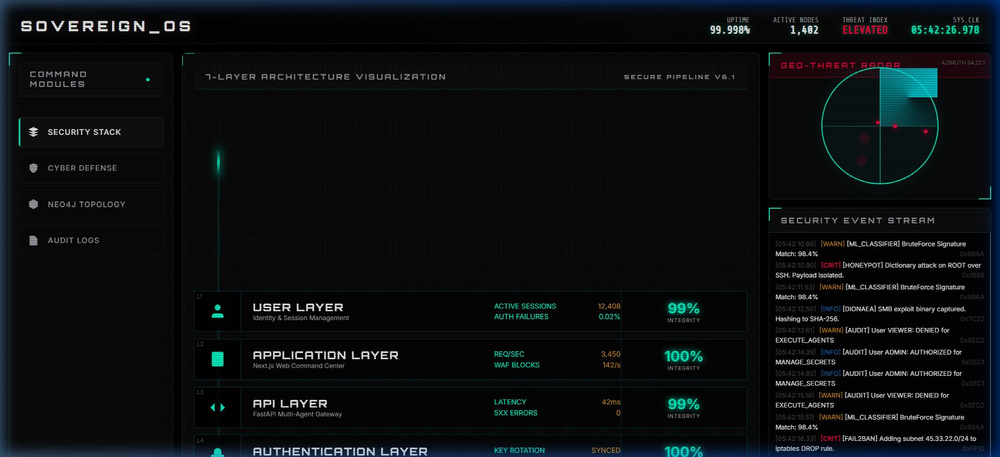
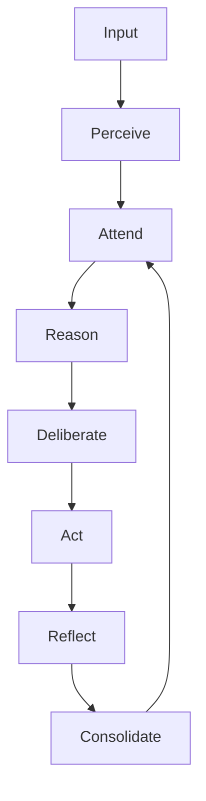

# 🛡️ DishaOS v3.0: Frontier Sovereign Intelligence

**The world's first self-healing, secure, and repository-aware AGI ecosystem.**

**DishaOS** has evolved into a globally elite, production-grade AGI infrastructure. It integrates a biological 7-stage cognitive engine with a multi-agent **Swarm** of specialists (Engineer, Security, Architect, Growth) to deliver autonomous code hardening and enterprise-grade cyber defense.

---

## 💎 The v3.0 "Frontier" Evolution

We have successfully completed the transformation of DishaOS into a **Frontier-Grade AGI Platform**.

### 🚀 Key Milestones Completed

- [x] **Autonomous Swarm:** Fully operational specialist agents (Engineer, Architect, Security, Growth).
- [x] **Self-Healing Loop:** Predictive code-hardening using `pydriller`.
- [x] **Enterprise Security:** RBAC, Audit Logs, and Encrypted Secrets Vault.
- [x] **Knowledge Mesh:** AST-aware RAG with Citation Grounding and Model Routing.
- [x] **Frontier Reasoning:** Self-correcting "Reflection" nodes and session-aware memory.
- [x] **Sovereign Devex:** n8n-style event orchestration and local model support.

---

## 📖 Table of Contents

- [Product Story](#product-story)
- [Visual Showcase](#visual-showcase)
- [Core Features](#core-features)
- [Architecture Deep Dive](#architecture-deep-dive)
- [Tech Stack](#tech-stack)
- [Installation and Setup](#installation-and-setup)
- [Usage Guide](#usage-guide)
- [30/60/90 Day Roadmap](#306090-day-roadmap)
- [Contributing](#contributing)

---

## Product Story

### The Pain Point

The current AI landscape is saturated with "chatbots" that lack persistent memory, fail to reason through complex ethics, and have zero defensive capabilities against hostile environments.

### The DISHA Solution

DISHA (Digital Intelligence & Sovereign Heuristic Assistant) was built to be a **Sovereign Guardian**. It treats the digital world as a battleground, using honeypots to learn from attackers and a multi-agent "Decision Nexus" to ensure that AI agency is never unchecked. It doesn't just answer; it **reasons**.

---

## Visual Showcase

### 1. The Sovereign Command Center



*Caption: Real-time monitoring of the 7-layer defense architecture and geo-threat radar.*

### 2. The Cognitive Deliberation Flow



*Caption: The biological state machine driving DishaOS reasoning.*

---

## Core Features

### 1. 7-Stage Cognitive Loop

Unlike standard "Ask-Response" agents, DISHA processes every signal through:

- **Perceive:** Intent & Entity Extraction.
- **Attend:** Working & Episodic Memory retrieval (with 0.92 decay rate).
- **Reason:** Competing Hypothesis generation.
- **Deliberate:** Multi-agent cross-examination (Political, Legal, Security, Ideological).
- **Act:** Execution with strict Confidence Thresholds (0.45).
- **Reflect:** Self-quality assessment.
- **Consolidate:** Long-term memory promotion.

### 2. Sentinel Cyber Defense Mesh

A native blue-team layer featuring:

- **Honeypots:** Cowrie, OpenCanary, and Dionaea integrated directly into the learning loop.
- **Anomaly Detection:** Unsupervised PyTorch autoencoders detecting zero-day network threats.
- **Tarpitting:** Adaptive TCP slowing to neutralize brute-force attackers.

### 3. Predictive Intelligence (PyDriller)

Autonomous repository analysis that identifies high-risk, bug-prone files based on historical commit churn and complexity metrics.

### 4. Voice Mode (WebRTC)

Low-latency audio streaming for hands-free "Jarvis-style" commanding using Whisper-based speech-to-text and ultra-fast TTS responses.

### 5. Go4Bid: Ephemeral Commerce

A privacy-first L1 reverse-auction engine:

- **Zero-PII Storage:** Ephemeral Redis memory with 30-minute TTL.
- **Blind Authentication:** Argon2id hashing for session integrity.

---

## Architecture Deep Dive

### Frontend (Next.js 15)

- **Framework:** Next.js with App Router.
- **State Management:** React Server Components + Client-side hooks for WebSocket streams.
- **Styling:** "Dark Luxury" Vanilla CSS + Tailwind for minimalist, premium dashboards.

### Backend (FastAPI + Python 3.11)

- **Orchestration:** FastAPI gateway managing asynchronous agent tasks.
- **RAG Pipeline:** AST-aware code chunking using `tree-sitter` and vectorized retrieval via `chromadb`.
- **Intelligence:** `HybridReasoner` switching between Symbolic and Neural logic.

### Infrastructure

- **Deployment:** Docker Compose for multi-service isolation.
- **Package Management:** `uv` by Astral for extreme performance and reproducible environments.

---

## Tech Stack

| Layer | Technologies |
| :--- | :--- |
| **Intelligence** | Python, FastAPI, PyTorch, LangChain, tree-sitter |
| **Web** | Next.js, React, TypeScript, Tailwind CSS, xterm.js |
| **Data** | Neo4j (Graph), Redis (Ephemeral), ChromaDB (Vector) |
| **DevOps** | Docker, Bun, uv, GitHub Actions |
| **Security** | Gitleaks, Bandit, Ruff, Biome |

---

## Installation and Setup

### Prerequisites

- Python 3.11+
- Node.js / Bun
- Docker & Docker Compose

### 1. Clone the Repository

```bash
git clone https://github.com/Tashima-Tarsh/Disha.git
cd Disha
```

### 2. Initialize Backend (uv)

```bash
cd disha-agi-brain/backend
uv venv
source .venv/bin/activate # or .venv\Scripts\activate on Windows
uv pip install -r requirements.txt
```

### 3. Initialize Frontend (Bun)

```bash
cd disha/apps/web
bun install
bun run dev
```

---

## Usage Guide

To engage the **Cognitive Loop** or deploy the **Sentinel Mesh**, refer to the detailed [Usage Documentation](docs/USAGE.md) or use the interactive terminal in the Command Center.

---

## 30/60/90 Day Roadmap

### Phase 1: Solidification (Current)

- [x] Establish 7-stage Cognitive Loop.
- [x] Implement Blue-Team Defense Mesh.
- [x] Integrate AST-aware RAG.

### Phase 2: Proactive Intelligence (Current)

- [x] **Voice Mode:** WebRTC + Audio Streaming integration.
- [x] **Predictive Hardening:** PyDriller-powered risk analysis.
- [x] **Swarm Expansion:** Adding autonomous PR agents for self-healing code.
- [x] **Reflection Node:** Self-correcting deliberation loops.
- [x] **Session Memory:** Persistent Redis-backed conversation context.

---

## Contributing

We maintain a **Top 0.1% code quality standard**.

1. Fork the repo.
2. Run `bun run lint` and `ruff check`.
3. Submit a PR with detailed architecture impact notes.

---

## License

Proprietary / Unlicensed. See [LICENSE](LICENSE) for details.

---

## Maintainer

**DishaOS Architect** — Engineering True Autonomy.

---

**[⭐ Star on GitHub](https://github.com/Tashima-Tarsh/Disha)** | **[🍴 Fork Repo](https://github.com/Tashima-Tarsh/Disha/fork)** | **[📖 Read Wiki](docs/HOME.md)**
