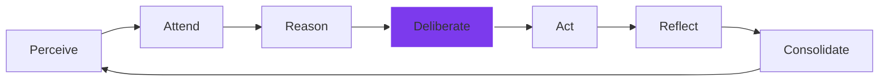

<p align="center">
  
</p>

# DISHA v5.0.0

<p align="center">
  <strong>"Direction" — The Autonomous Cognitive Operating System for the AGI Era.</strong>
</p>

<p align="center">
  
  
  
</p>

<p align="center">
  <a href="#what-is-disha">Overview</a> •
  <a href="#why-disha-matters">Mission</a> •
  <a href="#core-features">Features</a> •
  <a href="#tech-stack">Tech Stack</a> •
  <a href="#installation">Setup</a> •
  <a href="#architecture">Architecture</a> •
  <a href="#security">Security</a>
</p>

---

## 🌌 What is DISHA?

DISHA is a world-class **Autonomous Cognitive Platform** built to transcend standard LLM wrappers. It implements a sophisticated 7-stage cognitive loop that allows AI to perceive, deliberate, and reflect with biological elegance. 

At its core, DISHA is a **"Digital Soul"** for your infrastructure—capable of autonomous threat hunting, cross-domain knowledge synthesis, and strategic decision-making through a consensus of expert agents.

### 🧠 The 7-Stage Cognitive Loop

Unlike linear AI, DISHA processes information in a self-healing cycle:



1. **Perceive:** Real-time intent and entity extraction.
2. **Attend:** Retrieval from 3-layer persistent memory (Episodic, Semantic, Working).
3. **Reason:** Multi-perspective hypothesis generation.
4. **Deliberate:** Multi-agent consensus voting (Planner + Executor + Critic).
5. **Act:** Confidence-gated execution or clarification.
6. **Reflect:** Metacognitive analysis and quality scoring.
7. **Consolidate:** Knowledge graph updates and long-term memory formation.

---

## ⚡ Why DISHA Matters

In an era of increasing digital noise and complex threats, DISHA provides **Direction**. 
- **Autonomy:** Operates independently in a self-healing loop.
- **Precision:** Uses GNNs and RL to optimize investigation strategies.
- **Elite Performance:** Built on Bun + Python 3.13 for ultra-low latency intelligence.
- **Trust:** Transparent deliberation where dissenting views are preserved, not discarded.

---

## 🛠️ Tech Stack

DISHA is a masterclass in modern system architecture:

| Component | Technology | Role |
|-----------|------------|------|
| **Core Runtime** | [Bun](https://bun.sh/) | High-performance JS/TS engine |
| **Intelligence** | [Python 3.13](https://python.org) | Advanced ML/AI processing |
| **Frontend** | [Next.js 16](https://nextjs.org) | Luxury React Framework |
| **Styling** | [Tailwind CSS](https://tailwindcss.com) | Modern Utility Design |
| **Databases** | [Neo4j](https://neo4j.com) + [ChromaDB](https://trychroma.com) | Graph + Vector Memory |
| **Protocols** | [MCP](https://modelcontextprotocol.io) | Universal Tool Integration |

---

## 🏗️ 7-Layer Architecture

| Layer | Module | Purpose |
|-------|--------|---------|
| **1** | `src/` | **CLI Core:** High-performance terminal interface. |
| **2** | `ai-platform/` | **Global Brain:** Multi-agent backend & orchestrator. |
| **3** | `cognitive-engine/` | **Reasoning Core:** DISHA-MIND 7-stage loop. |
| **4** | `decision-engine/` | **Strategic Framework:** Multi-perspective decision making. |
| **5** | `cyber-defense/` | **Sentinel Shield:** ML-powered threat neutralization. |
| **6** | `quantum-physics/` | **Quantum Edge:** Advanced physics & circuit simulations. |
| **7** | `historical-strategy/` | **Strategy Engine:** Military & Geopolitical AI analysis. |

---

## 🚀 Installation

### Prerequisites
- **Bun** ≥ 1.1.0
- **Python** ≥ 3.11
- **Docker** + **Docker Compose**

### Quick Start
```bash
git clone https://github.com/Tashima-Tarsh/Disha.git
cd Disha
bun install
bun run build
./dist/cli.mjs
```

### Full Ecosystem Launch
```bash
cd ai-platform/docker
docker compose up -d
```
Access the Premium Dashboard at `http://localhost:3000`.

---

## 🛡️ Security

DISHA is built with a **Zero Trust** philosophy:
- **Sentinel Monitoring:** Real-time health and integrity checks.
- **Agent Isolation:** Each intelligence agent operates in a restricted context.
- **JWT Hardening:** Secure token-based authentication for all WebSockets.
- **SAST/DAST:** Continuous security scanning via CodeQL.

---

## 🗺️ Roadmap v5.x

- [ ] **v5.1:** Real-time Kafka streaming for live OSINT feeds.
- [ ] **v5.2:** Advanced molecular dynamics simulation in the Physics layer.
- [ ] **v5.3:** Multi-language (i18n) support for global deployment.
- [ ] **v6.0:** Full decentralized AGI distribution (Peer-to-Peer reasoning).

---

## 🤝 Contributing

We welcome elite researchers and engineers. See [CONTRIBUTING.md](./CONTRIBUTING.md) for guidelines.

## 📄 License

DISHA is licensed under the Apache 2.0 License. See [LICENSE](./LICENSE) for details.

---

<p align="center">
  <sub>DISHA — दिशा — Direction. Designed for the Future.</sub>
</p>
