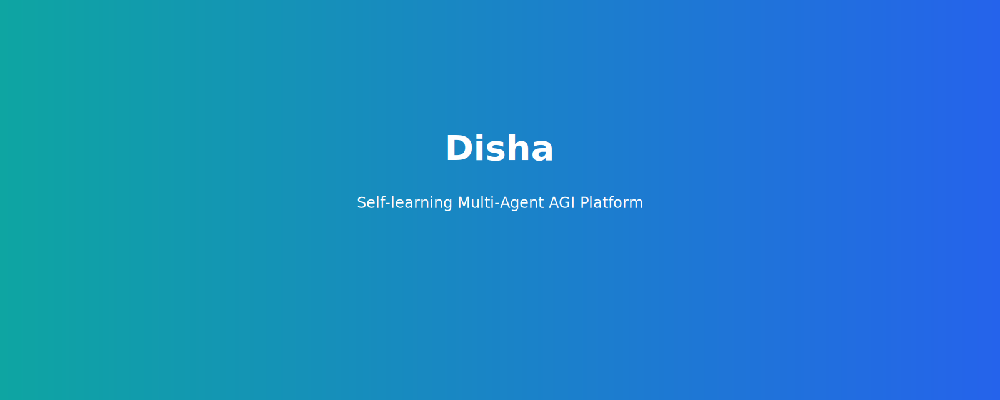

# 🛡️ Disha — Self-learning Multi-Agent AGI Platform

<p align="center">
  
</p>

<p align="center">
  <strong>Direction (दिशा)</strong> — A production-grade, multi-agent platform combining an AI coding assistant, OSINT & cyber-defense tooling, RL-driven investigators, and a realtime dashboard.
</p>

<p align="center">
  <a href="#quick-start"></a>
  
  
  
  
</p>

---

## Table of Contents
- [Why Disha](#why-disha)
- [Features](#features)
- [Quick Start](#quick-start)
- [Full Installation](#full-installation)
- [Architecture & Docs](#architecture--docs)
- [Contributing](#contributing)
- [License](#license)

---

## Why Disha
A single codebase combining a CLI coding assistant, a multi-agent intelligence platform (OSINT, Crypto, Detection, Graph, Reasoning, Vision, Audio), and a virtual cyber-defense honeypot & visualization dashboard. Built to be self-hostable, extensible, and oriented toward blue-team research and education.

## Features
A concise overview of Disha's core capabilities:

- Multi-agent AI: 7 specialist agents with an orchestrator and reasoning pipeline.
- Cyber Defense: Cowrie/Dionaea/OpenCanary honeypots + AI detection and simulated responses.
- CLI Assistant: Bun + TypeScript CLI with 40+ tools and IDE bridge.
- Reinforcement Learning: PPO engine optimizing investigation strategies.
- Multimodal: Vision (LLaVA/GPT-4o), Audio (Whisper), Text (LLMs).
- Web Dashboard: Next.js + Tailwind + real-time alerts, maps, graphs.

## Quick Start
Run the full stack locally using Docker Compose (recommended):

```bash
# Start core services (backend, frontend, Neo4j, ChromaDB)
cd ai-platform/docker
docker compose up -d
# Backend: http://localhost:8000
# Frontend: http://localhost:3001
```

If you prefer specific subsystems see [Full Installation](#full-installation).

## Full Installation
Detailed installation options (CLI engine, AI platform, Cyber defense, Historical strategy) remain in their respective folders. See:

- `ai-platform/README.md` — AI Intelligence Platform
- `cyber-defense/README.md` — Virtual Cyber Defense
- `historical-strategy/README.md` — Historical Strategy Intelligence

## Architecture & Docs
High-level architecture and detailed system documents live under `/docs` and each subsystem README. See:

- `docs/architecture.md`
- `docs/tools.md`
- `WIKI.md`

## Troubleshooting & Quick Commands
- Start CLI (dev): `bun run dev`
- Start AI backend (local): `uvicorn app.main:app --reload --port 8000`
- Start honeypots (docker): `cd cyber-defense && docker compose up -d`

## Contributing
1. Fork the repo and create a branch from `main`.
2. Keep PR scope focused and add tests where appropriate.
3. Update docs for any public-facing changes.

## License
MIT — see [LICENSE](./LICENSE)
