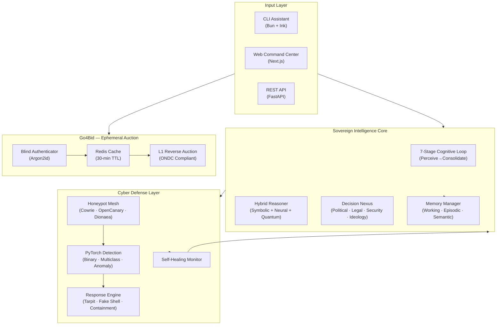

<div align="center">

# 🛡️ DISHA — Sovereign Intelligence Platform

### *Direction. Awareness. Decision. Resilience.*

**दिशा** — The AGI that thinks in cycles, defends in layers, and learns from every encounter.

<br/>

[](https://github.com/Tashima-Tarsh/Disha/actions)
[](https://github.com/Tashima-Tarsh/Disha/security/code-scanning)
[](./disha/docs/CHANGELOG.md)
[](https://python.org)
[](https://typescriptlang.org)
[](https://bun.sh)
[](./LICENSE)
[](https://github.com/Tashima-Tarsh/Disha/stargazers)

<br/>

> **DISHA is not an AI wrapper. It is a cognitive architecture.**
>
> A full-stack, autonomous AGI platform combining a 7-stage biological-inspired cognitive loop,
> an ML-powered honeypot cyber-defense system, a multi-agent decision nexus,
> real-time OSINT processing, and a privacy-first ephemeral auction engine —
> all inside a single, production-grade monorepo.

</div>

---

## 🧠 What Is DISHA?

Most AI systems respond. **DISHA deliberates.**

DISHA (Digital Intelligence & Strategic Holistic Analysis) is a sovereign AGI platform built for national-tier resilience, autonomous cyber defense, and multi-domain strategic reasoning. Unlike LLM wrappers that call an API and format a response, DISHA implements a **genuine cognitive pipeline** — perceiving intent, recalling episodic memory, generating rival hypotheses, running multi-agent deliberation across Political / Legal / Security / Ideology sub-agents, scoring confidence, reflecting on quality, and consolidating learning — all in a single async cycle.

Alongside the AGI core, DISHA ships:

- A **production honeypot system** (Cowrie + OpenCanary + Dionaea) with a PyTorch attack classifier
- A **self-healing monitor** that autonomously detects and restores degraded services
- A **multi-agent decision nexus** grounded in Indian constitutional law, geopolitical strategy, and national security doctrine
- **Go4Bid** — a privacy-first, ephemeral L1 reverse-auction engine built on ONDC principles with Redis-only persistence and zero PII storage
- A **CLI intelligence assistant** (`disha`) built on Bun with a rich terminal UI

---

## ⚡ Key Features

### 🧠 Cognitive Engine — 7-Stage Biological Loop

```
Perceive → Attend → Reason → Deliberate → Act → Reflect → Consolidate
```

Every query passes through all seven stages. Each stage has measurable output — intent extraction, entity recognition, working memory decay, Bayesian hypothesis ranking, multi-agent consensus voting, confidence scoring, episodic consolidation, and semantic concept promotion. It's not a chain of prompts. It's a cognitive cycle.

### 🔮 Hybrid Reasoning — Three Parallel Modes

| Mode | Method | When Used |
|------|--------|-----------|
| **Symbolic** | Rule-based + Decision Tree | Structured legal/policy queries |
| **Neural** | Transformer-style embedding | Open-ended reasoning |
| **Quantum-Inspired** | Superposition probability scoring | High-ambiguity, multi-outcome scenarios |

### 🛡️ Sentinel Cyber Defense System

- **Honeypot Mesh**: Cowrie (SSH), OpenCanary (HTTP/FTP/Redis/Git), Dionaea (SMB/MySQL)
- **ML Detection**: PyTorch binary classifier + 5-class attack classifier + unsupervised anomaly autoencoder
- **Response Engine**: Tarpit, fake shell, decoy filesystem, virtual containment zones
- **Zero offensive capability** — 100% blue-team simulation, containerized, isolated
- **Real-time ELK dashboard** with GeoIP enrichment and attack-pattern visualization

### ⚖️ Multi-Domain Decision Nexus

Four specialized agents deliberate on every strategic query:

| Agent | Domain | Grounding |
|-------|--------|-----------|
| **Political Agent** | Geopolitics & governance | Indian constitutional doctrine |
| **Legal Agent** | Regulatory & judicial reasoning | Case law + statute parsing |
| **Ideology Agent** | National interest & value alignment | Civilizational reasoning |
| **Security Agent** | Threat modeling & OSINT | Live intelligence feeds |

### 🏷️ Go4Bid — Privacy-First Ephemeral Auction Engine

- **Blind authenticator** using Argon2id — credentials never stored in plaintext
- **Redis-only persistence** — all session data wiped on a 30-minute TTL
- **Zero PII** — all personally identifiable information SHA-256 hashed before any storage
- **L1 Reverse Auction** — ONDC-compliant lowest-qualified-bidder matching
- **Honeypot Tarpit** — built-in attacker slowing via `workers/tarpit.js`

### 🤖 Adaptive Self-Healing (Disha Mythos)

DISHA runs an autonomous daily pipeline:

```
Threat Guardian Scan → Self-Healing Monitor → Knowledge Aggregation → Continuous Training
```

When services degrade, DISHA detects, diagnoses, and restores them — no human intervention required.

---

## 🏗️ Architecture

```
Tashima-Tarsh/Disha/
├── disha/
│   ├── ai/
│   │   ├── core/                     # Sovereign Intelligence Core
│   │   │   ├── cognitive_loop.py     # 7-stage CognitiveEngine
│   │   │   ├── decision_engine/      # Political+Legal+Security+Ideology agents
│   │   │   ├── intelligence/         # HybridReasoner, QuantumDecisionEngine, GoalEngine
│   │   │   ├── memory/               # WorkingMemory, EpisodicStore, SemanticGraph
│   │   │   ├── agents/               # AgentDeliberator (multi-agent consensus)
│   │   │   └── auto_learning/        # RAG pipeline, LLaMA fine-tuning stubs
│   │   ├── strategy/                 # Historical Strategy Nexus (predictive modeling)
│   │   ├── physics/                  # Molecular dynamics & quantum physics engine
│   │   ├── rag/                      # Vector retrieval for legal + OSINT corpora
│   │   └── models/                   # Model registry and checkpoints
│   ├── services/
│   │   ├── ai-platform/backend/      # FastAPI multi-agent service (14 specialized agents)
│   │   │   └── app/agents/           # Sentinel, OSINT, Crypto, Legal, Education, ...
│   │   ├── cyber/                    # Honeypot mesh + PyTorch detection + response engine
│   │   ├── alerts/                   # Real-time alerting microservice
│   │   ├── forecast/                 # Infrastructure resilience forecaster
│   │   ├── crime/                    # Crime-pattern analysis service
│   │   ├── integrations/
│   │   │   └── cyber-intelligence-platform/  # OpenCanary + connectors + OSINT
│   │   └── mcp/                      # Model Context Protocol server
│   ├── apps/
│   │   ├── web/                      # Next.js command center frontend
│   │   └── mobile/                   # Mobile guardian app
│   ├── scripts/
│   │   ├── disha_mythos.py           # Adaptive protection pipeline orchestrator
│   │   ├── threat_guardian.py        # Autonomous threat scan + neutralize
│   │   ├── monitor.py                # Self-healing service monitor
│   │   ├── continuous_train.py       # Daily training loop
│   │   └── knowledge_engine.py       # Cross-domain knowledge aggregator
│   ├── intelligence/                 # Repository intelligence (git miner, RAG, crawler)
│   └── legacy-root-src/              # CLI assistant (Bun runtime, React/Ink terminal UI)
├── go4bid/                           # Ephemeral L1 reverse-auction engine (Vite + React)
├── Portfolio-Website/                # Next.js portfolio site
├── .github/workflows/                # 11 production CI/CD pipelines
└── docker-compose.yml                # Full-stack orchestration
```

### System Interaction Diagram



---

## 🛠️ Technology Stack

<table>
<tr>
<th>Layer</th><th>Technology</th><th>Purpose</th>
</tr>
<tr><td><b>Runtime</b></td><td>Bun 1.3+, Node 20+</td><td>CLI, package management, TypeScript</td></tr>
<tr><td><b>Frontend</b></td><td>React 19, Next.js, Vite + TypeScript</td><td>Web command center, Go4Bid UI</td></tr>
<tr><td><b>AI Platform</b></td><td>FastAPI, Python 3.11</td><td>Multi-agent REST API (14 agents)</td></tr>
<tr><td><b>ML / DL</b></td><td>PyTorch, Scikit-Learn, Sentence-Transformers</td><td>Attack classification, anomaly detection</td></tr>
<tr><td><b>Memory</b></td><td>Neo4j, ChromaDB, Redis</td><td>Graph reasoning, vector retrieval, ephemeral cache</td></tr>
<tr><td><b>Streaming</b></td><td>Apache Kafka, WebSockets</td><td>Real-time OSINT feed processing</td></tr>
<tr><td><b>Security</b></td><td>Argon2id, SHA-256, Gitleaks, Bandit, pip-audit</td><td>Auth, PII hashing, secret scanning, SAST</td></tr>
<tr><td><b>Infra</b></td><td>Docker, docker-compose, GitHub Actions (11 pipelines)</td><td>Container orchestration, CI/CD</td></tr>
<tr><td><b>Linting</b></td><td>Biome (TS/JS), Ruff (Python)</td><td>Unified fast linting across both stacks</td></tr>
<tr><td><b>Observability</b></td><td>structlog, ELK Stack, OpenCanary JSON logs</td><td>Structured logging, attack dashboards</td></tr>
</table>

---

## 🚀 Quick Start

### Prerequisites

| Tool | Version | Purpose |
|------|---------|---------|
| [Bun](https://bun.sh) | `≥ 1.3` | TypeScript runtime & package manager |
| [Python](https://python.org) | `≥ 3.11` | Intelligence & cyber-defense layers |
| [Docker](https://docker.com) | `v2+` | Honeypot mesh & service orchestration |

### 1. Clone & Install

```bash
git clone https://github.com/Tashima-Tarsh/Disha.git
cd Disha
bun install
```

### 2. Configure Environment

```bash
cp .env.example .env
# Edit .env — add API keys, Redis URL, Neo4j credentials
```

### 3. Launch the Intelligence Stack

```bash
# Web command center (Next.js)
bun dev:web

# AI platform backend (FastAPI — 14 agents)
cd disha/services/ai-platform/backend
pip install -r requirements.txt
uvicorn app.main:app --reload --port 8000

# Cyber defense mesh (Docker)
cd disha/services/cyber
docker compose up -d
```

### 4. Run the CLI Assistant

```bash
bun run build
bun start
# or: node dist/cli.mjs
```

### 5. Launch Go4Bid Auction Engine

```bash
cd go4bid
npm install
npm run dev
# Open http://localhost:5173
```

### 6. Activate Autonomous Protection (Mythos)

```bash
# Full protection + self-healing cycle
python disha/scripts/disha_mythos.py --protect

# All phases: protect + learn + train
python disha/scripts/disha_mythos.py --all --train-rounds 3
```

---

## 🔌 API Reference

The AI Platform exposes a versioned REST API at `http://localhost:8000/api/v1/`.

### Available Agents

| Endpoint | Agent | Capability |
|----------|-------|-----------|
| `POST /api/v1/agents/sentinel` | Sentinel Agent | Threat analysis, incident reporting |
| `POST /api/v1/agents/osint` | OSINT Agent | Open-source intelligence gathering |
| `POST /api/v1/agents/legal` | Legal Agent | Constitutional & regulatory analysis |
| `POST /api/v1/agents/crypto` | Crypto Agent | Blockchain transaction analysis |
| `POST /api/v1/agents/detection` | Detection Agent | Anomaly & intrusion detection |
| `POST /api/v1/agents/reasoning` | Reasoning Agent | Multi-step logical inference |
| `POST /api/v1/agents/national` | National Intelligence | Geopolitical threat modeling |

### Example: Sentinel Threat Analysis

```bash
curl -X POST http://localhost:8000/api/v1/agents/sentinel \
  -H "Content-Type: application/json" \
  -d '{
    "target": "192.168.1.100",
    "signals": ["Multiple failed SSH attempts", "Lateral movement detected"],
    "context": "Production network segment B"
  }'
```

**Response:**

```json
{
  "target": "192.168.1.100",
  "is_security_alert": true,
  "defense_mode_active": true,
  "incident_report": "1. **Threat Summary**: High-confidence brute-force + lateral movement...",
  "confidence": 0.94,
  "recommended_actions": ["isolate_segment", "trigger_tarpit", "alert_soc"]
}
```

---

## 🔬 Security Architecture

DISHA is engineered with a **zero-trust, defense-in-depth** security model:

```
┌─────────────────────────────────────────────────────┐
│  SECRET SCANNING     → Gitleaks (every push)        │
│  SAST                → Bandit (Python static)        │
│  DEPENDENCY AUDIT    → pip-audit (CVE scanning)      │
│  SBOM GENERATION     → CycloneDX (full BOM)          │
│  CODE ANALYSIS       → CodeQL (Actions + JS + Python)│
│  HONEYPOT TARPIT     → workers/tarpit.js (Go4Bid)    │
│  BLIND AUTH          → Argon2id (Go4Bid)             │
│  PII PROTECTION      → SHA-256 hashing (all layers)  │
│  CONTAINER ISOLATION → no-new-privileges + mem caps  │
└─────────────────────────────────────────────────────┘
```

**The cyber-defense system is strictly blue-team.** It detects, classifies, and simulates responses — it executes zero real-world offensive actions.

### Responsible Disclosure

Security vulnerabilities can be reported privately via GitHub's [Security Advisories](https://github.com/Tashima-Tarsh/Disha/security/advisories) page.

---

## 📊 CI/CD Pipeline Status

| Pipeline | Scope | Trigger |
|----------|-------|---------|
| **CI** | TypeScript lint (Biome) + Bun unit tests | Every push/PR |
| **AI Platform CI** | Python lint (Ruff) + API tests | `disha/services/ai-platform/**` |
| **Cognitive Engine CI** | Ruff lint + cognitive loop tests (cov≥10%) | `disha/ai/core/**` |
| **Decision Engine CI** | Ruff lint + pipeline integration tests | `disha/ai/core/decision_engine/**` |
| **Cyber Defense CI** | Ruff lint + PyTorch ML tests + docker-compose validation | `disha/services/cyber/**` |
| **Sentinel CI** | Sentinel agent lint + async test suite | Sentinel agent changes |
| **Modules CI** | Strategy + Physics lint (Ruff) | `disha/ai/strategy/**`, `physics/**` |
| **Continuous Training** | Daily model training (2 AM UTC, synthetic) | Schedule + training scripts |
| **Disha Mythos** | Daily protect + heal cycle (3 AM UTC) | Schedule + every push |
| **Security Pipeline** | Gitleaks + Bandit SAST + pip-audit + SBOM | Every push/PR |
| **CodeQL Advanced** | Actions + JS/TS + Python deep analysis | Every push + weekly |

---

## 🗺️ Roadmap

### v6.1 — Edge Intelligence *(Q3 2026)*
- P2P distributed reasoning across edge nodes
- On-device model quantization (GGUF format)
- Mobile guardian app (iOS + Android)

### v6.5 — Quantum Acceleration *(Q4 2026)*
- Hardware-accelerated strategy simulation (IBM Qiskit integration)
- Multi-modal OSINT (image + audio + text fusion)
- Federated learning for privacy-preserving model updates

### v7.0 — Planetary-Scale Intelligence *(2027)*
- Global OSINT correlation across 50+ live feeds
- Nation-state digital twin with real-time resilience scoring
- Fully autonomous agentic task delegation with rollback

---

## 🤝 Contributing

We welcome engineers who think in systems, not scripts.

```bash
# 1. Fork the repository
# 2. Create your feature branch
git checkout -b feat/your-feature-name

# 3. Run linting before committing
bun run lint                                        # TypeScript
ruff check disha/ --output-format=github            # Python
ruff format disha/ --check

# 4. Run tests
bun test disha/legacy-root-src/                    # TS unit tests
python -m pytest disha/ai/core/tests/ -v           # Cognitive engine
python -m pytest disha/services/cyber/tests/ -v    # Cyber defense

# 5. Open a Pull Request against main
```

Please read [`disha/docs/CONTRIBUTING.md`](./disha/docs/CONTRIBUTING.md) and follow the [Code of Conduct](./disha/docs/CODE_OF_CONDUCT.md).

### Issue Templates

- 🐛 [Bug Report](.github/ISSUE_TEMPLATE/bug_report.md)
- ✨ [Feature Request](.github/ISSUE_TEMPLATE/feature_request.md)
- 🔒 [Security Vulnerability](https://github.com/Tashima-Tarsh/Disha/security/advisories)

---

## ❓ FAQ

**Q: Is this safe to run? Does it attack anything?**
> DISHA's cyber-defense layer is 100% defensive. All honeypots run in isolated containers. The response engine only simulates countermeasures — no real exploits, no network modifications, no external connections initiated.

**Q: Does Go4Bid store any user data permanently?**
> No. Go4Bid uses Redis with a 30-minute TTL. All PII is SHA-256 hashed before any logging. When the session expires, the data is gone.

**Q: What makes the cognitive loop different from a standard LLM call?**
> Standard LLM: input → model → output. DISHA Cognitive Loop: perceive intent → decay working memory → retrieve episodic/semantic context → generate rival hypotheses → run 3-mode reasoning → multi-agent deliberation (Political/Legal/Security/Ideology) → confidence scoring → action selection → quality reflection → memory consolidation → concept promotion. Seven stages, all measurable, all logged.

**Q: Can I run this without Docker?**
> Yes, for the intelligence core. The honeypot mesh requires Docker (Cowrie, Dionaea, OpenCanary). The cognitive engine, decision nexus, and API backend all run with just Python 3.11 + pip.

**Q: Is there a demo or live instance?**
> The portfolio site is live at [tashima-tarsh.github.io/Disha](https://tashima-tarsh.github.io/Disha/). A live API demo is planned for v6.1.

---

## 📄 License

DISHA is licensed under the **Apache License 2.0**. See [LICENSE](./LICENSE) for details.

---

## 👤 About the Builder

**Tashima Tarsh** — Systems architect, AI researcher, and open-source builder.

DISHA began as a question: *What would it mean to build an AI that actually deliberates — not just responds?* Three years and 67 branches later, the answer is a monorepo spanning cognitive science, national security doctrine, Indian constitutional law, distributed systems, and ephemeral privacy engineering.

The project name दिशा (Disha) means **Direction** in Sanskrit — chosen deliberately, because intelligence without direction is just noise.

> *"The goal was never to build a chatbot. It was to build a system that earns the right to take consequential action by demonstrating it can reason about consequences."*

---

<div align="center">

**If DISHA taught you something or saved you time, a ⭐ star means the world.**

[](https://github.com/Tashima-Tarsh/Disha/stargazers)
[](https://github.com/Tashima-Tarsh/Disha/fork)
[](https://github.com/Tashima-Tarsh/Tashima-Tarsh)

<br/>

*DISHA — Sovereign Intelligence for a Resilient Nation.*
*दिशा — Direction. Engineered for the Future.*

</div>
