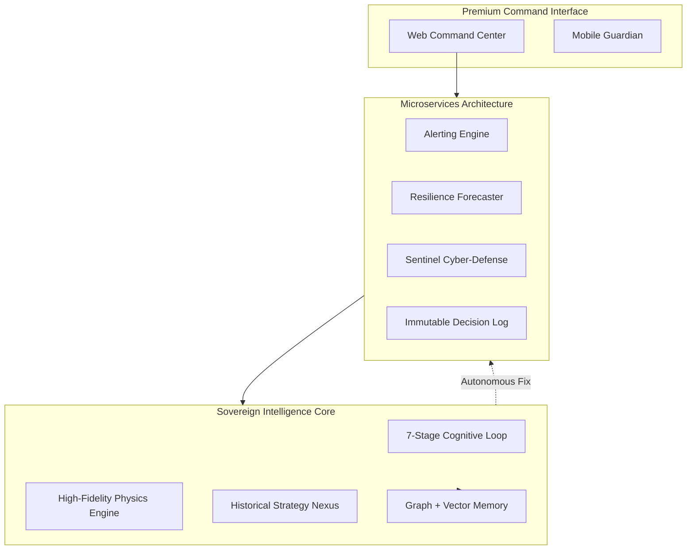

# DISHA v6.0.0 — Sovereign Intelligence Platform

<p align="center">
  
</p>

<p align="center">
  <a href="https://github.com/Tashima-Tarsh/Disha/actions"></a>
  <a href="./disha/docs/CHANGELOG.md"></a>
  <a href="./LICENSE"></a>
  
</p>

---

## 🛡️ National Protection & Predictive Resilience

**DISHA (Digital Intelligence & Strategic Holistic Analysis)** is a world-class, sovereign AGI platform engineered for national-tier defense, critical infrastructure resilience, and autonomous system self-healing.

Unlike traditional AI wrappers, DISHA implements a **7-stage biological-inspired cognitive loop** that enables it to perceive, reason, and deliberate with unprecedented depth. It acts as a decentralized guardian, correlating domestic priorities with global volatility to ensure the stability of the nation's digital and physical assets.

---

## 🏛️ System Architecture

DISHA v6 operates as a high-scale monorepo, orchestrating a complex web of specialized AI agents and microservices.



---

## ⚡ Core Features

- **🧠 7-Stage Cognitive Loop**: Advanced reasoning cycle (Perceive → Attend → Reason → Deliberate → Act → Reflect → Consolidate).
- **🛡️ Sentinel Guardian**: ML-powered threat detection that auto-neutralizes attacks and restarts failed services.
- **🗺️ Predictive Resilience**: Real-time mapping of weather, crime, and health indicators onto a national infrastructure digital twin.
- **🧬 Multi-Physics Core**: Molecular Dynamics simulation (Project SETU) for stress-testing materials and structures.
- **⚖️ Judicial Intelligence**: Automated regulatory auditing (Project NYAYA) ensuring zero-trust governance.

---

## 🛠️ Performance Tech Stack

Built for ultra-low latency and massive scale:

| Core | Intelligence | Infrastructure |
|:--- |:--- |:--- |
| **Bun v1.2+** | **Python 3.13** | **Docker / K8s** |
| **React 19** | **PyTorch** | **Neo4j** |
| **Next.js 16** | **Scikit-Learn** | **ChromaDB** |
| **TypeScript 5.6** | **FastAPI** | **Apache Kafka** |

---

## 🚀 Quick Start

### 1. Prerequisites
Ensure you have the following installed:
- **Bun** (Primary Runtime)
- **Python 3.12+** (Intelligence Layer)
- **Docker** (Microservice Orchestration)

### 2. Initialization
```bash
# Clone the repository
git clone https://github.com/Tashima-Tarsh/Disha.git
cd Disha

# Install unified workspace dependencies
bun install
```

### 3. Launch Sovereign Command
```bash
# Start the Web Command Center
bun dev:web

# Launch Backend Resilience Services
# (Each service runs as a decoupled FastAPI instance)
cd disha/services/alerts && python main.py
```

---

## 🗺️ Strategic Roadmap
- **v6.1**: Decentralized P2P Reasoning & Edge-Device optimization.
- **v6.5**: Quantum-hardware accelerated strategy simulation.
- **v7.0**: Global Planetary-Scale OSINT correlation.

See the full [ROADMAP.md](./disha/docs/ROADMAP.md) for details.

---

## 🤝 Participation & Support

We welcome elite engineers and researchers to contribute to the future of national resilience.

- **Docs**: [Technical Documentation Portal](./disha/docs/README.md)
- **Walkthrough**: [Repository Walkthrough](./REPO_WALKTHROUGH.md)
- **Contributing**: [Contribution Guidelines](./disha/docs/CONTRIBUTING.md)
- **Security**: [Vulnerability Disclosure](./disha/docs/SECURITY.md)

---

<p align="center">
  <sub>DISHA — Sovereign Intelligence for a Resilient Nation. <br> दिशा — Direction. Designed for the Future.</sub>
</p>
