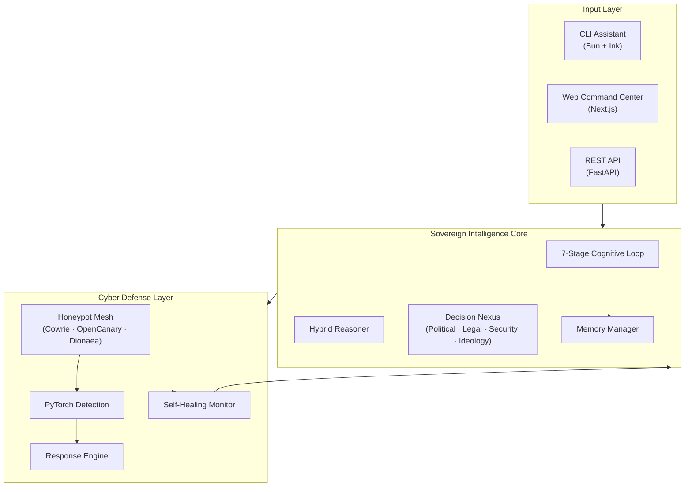

<div align="center">
  <h1 align="center">DishaOS: The Autonomous Agentic Framework</h1>
  <p align="center">
    <strong>Engineered for Next-Generation Cognitive Loops, Elite RAG, and Swarm Intelligence.</strong>
  </p>
  <p align="center">
    <a href="https://github.com/Tashima-Tarsh/Disha/stargazers"></a>
    <a href="https://github.com/Tashima-Tarsh/Disha/network/members"></a>
    <a href="https://github.com/Tashima-Tarsh/Disha/issues"></a>
    <a href="https://github.com/Tashima-Tarsh/Disha/actions"></a>
    <a href="./LICENSE"></a>
  </p>
</div>

---

## 🌌 The Next Era of Intelligence
DishaOS is not a chatbot. It is a **production-grade, autonomous intelligence framework**. Most AI systems simply respond. **DishaOS deliberates.**

Built for engineers who want to deploy multi-agent systems, continuous cognitive loops, and secure, sandboxed AI environments. It combines a 7-stage biological-inspired cognitive loop, an ML-powered honeypot cyber-defense system, a multi-agent decision nexus, real-time OSINT processing, and a privacy-first ephemeral auction engine—all inside a single, production-grade monorepo.

### ⚡ Why DishaOS Wins
- **Continuous Cognitive Loops:** Real-time reasoning over live data. (Perceive → Attend → Reason → Deliberate → Act → Reflect → Consolidate).
- **AST-Aware RAG:** We chunk by syntax (Functions/Classes), not by blind line counts. Standard RAG is dead.
- **Swarm Architecture:** Specialized Engineer, Security, Legal, and Architect agents debating and executing in parallel.
- **Enterprise Security:** Fully sandboxed execution, RBAC, Honeypot mesh, and granular memory isolation.

---

## 🏗️ Architecture Overview



---

## 🚀 Quick Start

### Prerequisites
- **Bun** (≥ 1.3)
- **Python** (≥ 3.11)
- **Docker** (v2+)

### 1. Clone & Install
```bash
git clone https://github.com/Tashima-Tarsh/Disha.git
cd Disha
bun install
```

### 2. Configure Environment
```bash
cp .env.example .env
# Edit .env — add API keys, Redis URL, Neo4j credentials
```

### 3. Launch the Intelligence Stack
```bash
# AI platform backend (FastAPI — 14 agents)
cd disha-agi-brain/backend
uv pip install -r requirements.txt
python main.py

# Web command center (Next.js)
bun dev:web

# Cyber defense mesh (Docker)
cd disha/services/cyber
docker compose up -d
```

### 4. Activate Autonomous Protection
```bash
python disha/scripts/disha_mythos.py --protect
```

---

## 🔌 API Reference

The AI Platform exposes a versioned REST API.

| Endpoint | Agent | Capability |
| --- | --- | --- |
| `POST /api/v1/agents/sentinel` | Sentinel Agent | Threat analysis, incident reporting |
| `POST /api/v1/agents/osint` | OSINT Agent | Open-source intelligence gathering |
| `POST /api/v1/agents/legal` | Legal Agent | Constitutional & regulatory analysis |
| `POST /api/v1/agents/reasoning` | Reasoning Agent | Multi-step logical inference |

---

## 🛡️ Enterprise Trust & Security

DishaOS is engineered with a **zero-trust, defense-in-depth** security model. 

- **SAST & Secret Scanning:** Gitleaks, Bandit, pip-audit.
- **Honeypot Tarpit:** Built-in attacker slowing mechanisms.
- **Container Isolation:** Strict no-new-privileges and memory caps.

Please see our [SECURITY.md](./SECURITY.md) for vulnerability disclosure policies.

---

## 🤝 Join the Inner Circle

We welcome engineers who think in systems, not scripts. 
Please read our [Contributing Guidelines](./CONTRIBUTING.md) and our [Code of Conduct](./CODE_OF_CONDUCT.md).

---

<div align="center">
  <h3>Built by <a href="https://github.com/Tashima-Tarsh">Tashima Tarsh</a></h3>
  <p>Architecting Autonomous Systems | Creator of DishaOS</p>
  <br>
  <p>If DishaOS taught you something or saved you time, a ⭐ star means the world.</p>
</div>
