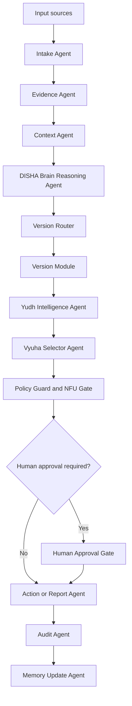

# DISHA

DISHA is an evidence-first agentic intelligence architecture for national-scale reasoning, geospatial awareness, governance audit, cyber defence, public-sector accountability, and human-governed action.

It is not a generic chatbot. The production direction is a defensive, audit-first system that classifies evidence, links sources, applies No-First-Use boundaries, routes work through versioned intelligence modules, and requires human approval when risk or ambiguity crosses policy thresholds.

## What Is Production-Oriented Now

- `disha/brain/`: central reasoning spine, FastAPI backend, graph orchestration, policy gates, evidence model, memory, audit, Yudh/Vyuha logic, and six version modules.
- `web/`: hardened Next.js API surface with auth, audit, export/share, file, and agent endpoints.
- `src/`: TypeScript CLI/runtime hardening modules and MCP entrypoint.
- `demos/`: runnable JSON payloads for the six DISHA versions.
- `tests/test_disha_brain_graph.py`: focused tests for evidence classification, version routing, NFU, Vyuha, audit, memory, geospatial validation, HSE, national audit, and end-to-end graph invocation.

Legacy and experimental surfaces remain under `legacy/`, `disha/services/`, `disha/ai/`, and integrations. They should be reused only after source review.

## Six DISHA Versions

| Version | Module | Purpose |
| --- | --- | --- |
| 1.6 | Geospatial Detection Intelligence | Coordinates, sensor evidence, object tracking, public-safety evidence bundles. |
| 2.6 | Sustainable Development Geospatial Intelligence | Infrastructure monitoring, climate/resource signals, SETU/VARUNA resilience scoring. |
| 3.6 | Physical Interface Architecture | Edge telemetry, trusted device state, sensor-to-brain routing, operator control. |
| 4.6 | HSE Intelligence | Health, social welfare, education access, district-level service gap reports. |
| 5.6 | National Audit Intelligence | RTI, open data, constitutional references, public accountability, contradiction detection. |
| 6.6 | Gap Closure Intelligence | Gap identification, risk mitigation, Yudh assessment, Vyuha selection, lawful corrective action. |

## Agentic Flow


```mermaid
flowchart TD
    A[Input sources] --> B[Intake Agent]
    B --> C[Evidence Agent]
    C --> D[Context Agent]
    D --> E[DISHA Brain Reasoning Agent]
    E --> F[Version Router]
    F --> G[Version Module]
    G --> H[Yudh Intelligence Agent]
    H --> I[Vyuha Selector Agent]
    I --> J[Policy Guard and NFU Gate]
    J --> K{Human approval required?}
    K -->|Yes| L[Human Approval Gate]
    K -->|No| M[Action or Report Agent]
    L --> M
    M --> N[Audit Agent]
    N --> O[Memory Update Agent]
```

Each result includes version, evidence class, source list, confidence level, risk score, reasoning summary, Yudh assessment, Vyuha recommendation, NFU policy status, human approval requirement, final recommendation, and audit event.

## Quickstart

```bash
python -m pytest tests/test_disha_brain_graph.py
```

Run a demo payload:

```bash
python - <<'PY'
import json
from pathlib import Path
from disha.brain.graph import DishaAgenticGraph, GraphInput

payload = json.loads(Path("demos/demo_5_6_national_audit.json").read_text())
result = DishaAgenticGraph().invoke(GraphInput(**payload))
print(result.model_dump_json(indent=2))
PY
```

Run the existing web checks:

```bash
cd web
npm run test
npm run type-check
npm run build
```

## Trust Boundaries

DISHA never treats all text as truth. Inputs are classified as verified, official record, RTI record, open data, sensor signal, audit record, constitutional reference, inference, allegation, contradiction, or unresolved. Unsupported facts stay marked as requiring verification.

No-First-Use is enforced in code under `disha/brain/policy/no_first_use.py`. Offensive, retaliatory, unauthorized, or destructive actions are blocked. Ambiguous actions require human approval.

## Documentation

- [Architecture](docs/ARCHITECTURE.md)
- [Product Thesis](docs/PRODUCT_THESIS.md)
- [Version Ladder](docs/VERSION_LADDER.md)
- [DISHA Brain](docs/DISHA_BRAIN.md)
- [Agentic Flow](docs/LANGGRAPH_AGENTIC_FLOW.md)
- [Yudh/Vyuha Doctrine](docs/YUDH_VYUHA_DOCTRINE.md)
- [No-First-Use](docs/NO_FIRST_USE.md)
- [Evidence Model](docs/EVIDENCE_MODEL.md)
- [Trust Model](docs/TRUST_MODEL.md)
- [Demos](docs/DEMOS.md)
- [Roadmap](docs/ROADMAP.md)

## Remaining Gaps

- External source verification connectors need production credentials, publisher allowlists, and retrieval audits.
- Domain models for HSE, geospatial, governance, and resilience need expert-reviewed datasets.
- Persistent graph memory and audit export need deployment-specific storage guarantees.
- Existing legacy integrations need security review before being promoted into the production spine.
- thenitishkr.in and the two DISHA Intelligence books are referenced by the product brief, but repository-verifiable source material is not present here. Their exact relationship is [VERIFY REQUIRED].
