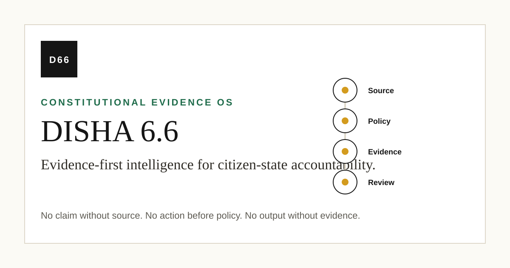
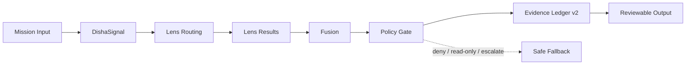

<div align="center">

# DISHA 6.6

**The Constitutional Evidence Operating System**

Turn public records, mission requests, policy gates, and model assistance into intelligence that can show its evidence chain.

[](https://github.com/Tashima-Tarsh/Disha/actions/workflows/ci.yml)
[](https://github.com/Tashima-Tarsh/Disha/actions/workflows/codeql.yml)




```bash
npm install --prefix web && npm.cmd --prefix web run dev
```

Open `http://127.0.0.1:3000/workbench`.

</div>

---

## Why This Matters

AI systems can now summarize, classify, and route information quickly. The harder problem is whether anyone can inspect the evidence behind the answer.

DISHA is built for public-interest intelligence where unsupported confidence is dangerous: governance audits, source-backed civic research, cyber harm assessment, legal-public record review, open-data triage, and citizen-state accountability.

The rule is simple:

```text
no claim without source
no action before policy
no output without evidence
```

DISHA is not a chatbot skin, a speculative dashboard, or a collection of imported experiments. The active product spine is a governed runtime where missions become typed signals, signals pass through lenses, actions pass through policy, and outputs are written into a tamper-evident evidence chain.

## How It Works


```mermaid
flowchart LR
    A["Mission Input"] --> B["DishaSignal"]
    B --> C["Lens Routing"]
    C --> D["Lens Results"]
    D --> E["Fusion"]
    E --> F["Policy Gate"]
    F --> G["Evidence Ledger v2"]
    G --> H["Reviewable Output"]
    F -. "deny / read-only / escalate" .-> I["Safe Fallback"]
```

Every mission is evaluated through the same discipline:

1. Normalize the request into a structured `DishaSignal`.
2. Route through domain lenses such as governance, cyber, geospatial, strategy, Yudh View, and simulation.
3. Fuse agreements, conflicts, uncertainty, and recommended non-executable actions.
4. Evaluate policy before output.
5. Write mission events into the ledger with ordered hashes.
6. Export a reviewable report that marks unsupported claims as `[VERIFY REQUIRED]`.

## Key Features

- **Evidence Ledger v2:** PostgreSQL-backed, ordered mission chains with payload hashes, previous hashes, and event hashes.
- **Policy Gate:** deny-by-default control for unsafe actions, controlled data, unsupported claims, and offensive cyber requests.
- **Agentic Workbench:** interactive `/workbench` flow showing mission input, signal normalization, lens routing, fusion, policy, ledger, and export.
- **Governed Model Adapter:** model output is advisory, logged, policy-filtered, and never treated as a source of fact.
- **Source Registry:** official/public source manifests for law, gazette, finance, audit, cybercrime, vulnerability intelligence, geospatial, water, disaster, and open-data references.
- **Security Source Admission:** official public feeds can be admitted; leaked, credential, token, private-key, hacked, or exfiltrated material is blocked.
- **Production Checks:** CI, tests, type-checking, build, CodeQL, Dependabot, and npm audit are part of the product hygiene loop.

## Getting Started

Install and run:

```bash
npm install --prefix web
npm.cmd --prefix web run dev
```

Open:

```text
http://127.0.0.1:3000/workbench
```

Verify locally:

```bash
npm.cmd --prefix web run type-check:full
npm.cmd --prefix web test
npm.cmd --prefix web run build
```

Query the API health endpoint:

```bash
curl http://127.0.0.1:3000/api/v1/health
```

Preview the public documentation page:

```bash
python -m http.server 8099 -d docs
```

Open `http://127.0.0.1:8099/`.

## Who It Is For

| Persona | What DISHA Helps With |
| --- | --- |
| Civic researchers | Turn scattered public records into source-linked evidence trails. |
| Journalists | Separate verified documents, open questions, and claims requiring review. |
| Security teams | Use official public advisories for defensive triage without enabling offensive activity. |
| Policy analysts | Inspect how a conclusion moved through source, lens, policy, and evidence. |
| Open-source builders | Study an evidence-first pattern for governed agentic systems. |
| Public-interest technologists | Build tools that preserve restraint, provenance, and citizen accountability. |

## Technical Highlights

| Layer | Path | Responsibility |
| --- | --- | --- |
| API runtime | `web/app/api/v1/` | Mission, lens, policy, evidence, source, agentic, and readiness endpoints |
| Agentic workbench | `web/app/workbench/` | Interactive demo of the full DISHA mission flow |
| Contracts | `web/lib/unified/contracts.ts` | `DishaSignal`, `DishaLensResult`, `PolicyDecision`, `EvidenceEvent` |
| Orchestration | `web/lib/unified/orchestrator.ts` | Signal normalization, lens routing, fusion, policy evaluation |
| Policy gate | `web/lib/unified/policy-gate.ts` | Deny, read-only, sandbox, escalation, and approval decisions |
| Evidence ledger | `web/lib/unified/evidence-ledger.ts` | PostgreSQL-backed ordered hash chains in production |
| Source registry | `web/lib/unified/source-registry.ts` | Official/public source definitions, probes, and source admission |
| Verification | `web/tests/` | Product-spine regression tests |
| Public page | `docs/public/` and `docs/index.html` | GitHub Pages-safe public doctrine surface |

## API Surface

Base path:

```text
/api/v1
```

Important endpoints:

- `GET /api/v1/health`
- `POST /api/v1/mission`
- `POST /api/v1/agentic/mission`
- `POST /api/v1/policy/evaluate`
- `POST /api/v1/lenses/{lens}/analyze`
- `GET /api/v1/evidence/{missionId}`
- `POST /api/v1/evidence/export`
- `GET /api/v1/sources/registry`
- `POST /api/v1/sources/probe`
- `GET /api/v1/sources/admit`
- `POST /api/v1/sources/admit`
- `GET /api/v1/architecture`
- `GET /api/v1/production/readiness`

See [docs/api/API_REFERENCE.md](docs/api/API_REFERENCE.md).

## Production Configuration

Required for production:

```env
NODE_ENV=production
DATABASE_URL=postgres://...
DISHA_AUTH_MODE=oidc
DISHA_JWT_SECRET=<strong-secret>
```

Optional governed model mode:

```env
DISHA_MODEL_PROVIDER=openai
OPENAI_API_KEY=<key>
OPENAI_MODEL=<model>
```

Model output is never a source of fact. It is logged, policy-filtered, and treated as advisory.

## Current Status

DISHA 6.6 is an MVP-grade product spine with a working Next.js API/runtime, evidence ledger hardening, policy gate, source registry, source admission, agentic workbench, docs, and CI.

Still intentionally marked as roadmap:

- Durable mission-result storage beyond the evidence ledger.
- More source-specific parsers with claim-level provenance.
- Production OIDC deployment guide with a reference provider.
- Visual Evidence Chain Explorer beyond the current workbench view.
- Real community issue backlog after public launch.

## Repository Boundary

| Zone | Status |
| --- | --- |
| `web/` | Active product runtime |
| `web/lib/unified/` | Production contracts and governed logic |
| `docs/` | Public doctrine, architecture, API, roadmap, and release material |
| `legacy/` | Archive and research material |
| `disha/services/integrations/` | External integrations and imported research, not automatically production |

Nothing enters the active product spine unless it passes:

```text
contract -> policy -> evidence -> test
```

## Contributing

Good first contributions:

- Add a source parser fixture for one registered public source.
- Improve `/workbench` accessibility and keyboard navigation.
- Add evidence-chain visual tests.
- Extend source admission tests for new official public feeds.
- Improve docs for a specific persona: journalist, researcher, policymaker, or developer.

Read [CONTRIBUTING.md](CONTRIBUTING.md) before opening a PR. Public claims must be sourced or marked `[VERIFY REQUIRED]`.

## Citation

If you reference DISHA in research, writing, or presentations:

```bibtex
@software{disha66,
  title = {DISHA 6.6: The Constitutional Evidence Operating System},
  author = {Tashima-Tarsh},
  year = {2026},
  url = {https://github.com/Tashima-Tarsh/Disha},
  note = {Evidence-first governance intelligence with policy gates and provenance}
}
```

## License

The repository currently contains a placeholder license file and is detected by GitHub as `Other`. Before a major open-source launch, the maintainer should replace it with a standard license such as Apache-2.0 or MIT. Until then, do not assume reuse rights beyond what the owner explicitly grants.

## Key Documents

- [Why DISHA](docs/product/WHY_DISHA.md)
- [Agentic Workbench](docs/product/AGENTIC_WORKBENCH.md)
- [Architecture](docs/ARCHITECTURE.md)
- [Evidence Model](docs/EVIDENCE_MODEL.md)
- [Evidence Chain Explorer](docs/product/EVIDENCE_CHAIN_EXPLORER.md)
- [Policy Gate](docs/security/POLICY_GATE.md)
- [API Reference](docs/api/API_REFERENCE.md)
- [Repository Guide](docs/REPOSITORY_GUIDE.md)
- [Roadmap](docs/ROADMAP.md)
- [Public Launch Checklist](docs/release/PUBLIC_LAUNCH_CHECKLIST.md)
- [Changelog](CHANGELOG.md)

## Star

If DISHA helps you think more clearly about evidence-led AI, policy-gated agents, or constitutional technology, star the repo so more builders can find it.
