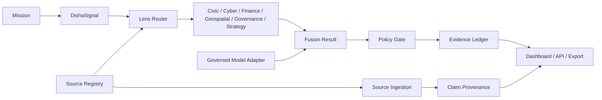

<div align="center">

# DISHA 6.6

**Constitutional Evidence Operating System**

Source-first intelligence, policy-gated reasoning, and evidence-led action for public-interest analysis.


</div>

---

## Product Thesis

DISHA v6.6 is not a generic chatbot, dashboard skin, or repository of disconnected experiments. It is a governed intelligence workbench with one hard product contract:

```text
receive mission -> normalize signal -> analyze through governed lenses
-> evaluate policy -> write evidence -> return auditable result
```

If DISHA cannot prove a claim, it must say so. If DISHA can prove it, it must show the chain.

## Executive Snapshot

| Layer | Active Surface | Responsibility |
| --- | --- | --- |
| Product runtime | `web/` | Next.js UI, API routes, product surfaces |
| API contract | `web/app/api/v1/` | Mission, lens, policy, evidence, data, health |
| Core logic | `web/lib/unified/` | Contracts, orchestration, lenses, policy gate, ledger |
| Verification | `web/tests/` | Product-spine and integration tests |
| Public doctrine | `docs/public/` | GitHub Pages-safe public documentation |
| Wiki | `docs/wiki/` | Architecture, roadmap, publishing, security, GTM |

## Active Product Spine

| Capability | Status | Notes |
| --- | --- | --- |
| Mission pipeline | Active | Mission input becomes a typed DISHA signal. |
| Governed lenses | Active | Analysis is routed through explicit product lenses. |
| Policy gate | Active | Sensitive action must pass policy evaluation. |
| Evidence ledger | Active | Outputs are tied to evidence and provenance records. |
| Source registry | Active | Official/public source coverage is registered and governed. |
| Model adapter | Optional | OpenAI-compatible mode is governed, not assumed. |
| Public documentation | Active | `docs/public/` can be published without exposing private runtime code. |

## Architecture Map


```mermaid
flowchart LR
  A["Mission"] --> B["DishaSignal"]
  B --> C["Lens Router"]
  C --> D["Civic / Cyber / Finance / Geospatial / Governance / Strategy"]
  D --> E["Fusion Result"]
  E --> F["Policy Gate"]
  F --> G["Evidence Ledger"]
  G --> H["Dashboard / API / Export"]
  I["Source Registry"] --> C
  I --> J["Source Ingestion"]
  J --> K["Claim Provenance"]
  K --> H
  L["Governed Model Adapter"] --> E
```

## Repository Boundary

DISHA keeps one production line and one archive line.

| Zone | Meaning |
| --- | --- |
| `web/` | Active production product surface. |
| `web/lib/unified/` | Product contracts and governed business logic. |
| `docs/product/`, `docs/architecture/`, `docs/wiki/` | Product, architecture, and operating doctrine. |
| `docs/public/` | Public documentation site, safe for GitHub Pages. |
| `legacy/`, older archived app folders | Source archive material. Not active production unless promoted through contracts, policy, evidence, and tests. |

## Public Page

The public documentation page lives here:

```text
docs/public/index.html
```

Local preview:

```bash
python -m http.server 8099 -d docs/public
```

Open:

```text
http://127.0.0.1:8099/
```

The Pages workflow publishes only `docs/public/`:

```text
.github/workflows/pages.yml
```

If the repository is made private and GitHub Pages is unavailable for the account plan, mirror only `docs/public/` into a separate public documentation repository.

## Verification

Run from the repository root:

```bash
npm run verify
```

Equivalent web checks:

```bash
npm --prefix web run type-check
npm --prefix web test
npm --prefix web run build
```

## Local Development

```bash
npm install --prefix web
npm run dev
```

Default local app:

```text
http://127.0.0.1:3000
```

## Operating Rules

- Facts, statistics, legal claims, government references, incident totals, and dates must be verified.
- Unsupported claims must remain marked as `[VERIFY REQUIRED]`.
- Private runtime code, credentials, local databases, and controlled evidence do not belong in public docs.
- Archived code becomes product only after it passes: `contract -> policy -> evidence -> test`.

## Key Documents

| Document | Purpose |
| --- | --- |
| `docs/product/DISHA_V6_6_PRODUCT_SPEC.md` | Product specification |
| `docs/architecture/UNIFIED_INTELLIGENCE_OS.md` | Unified architecture |
| `docs/architecture/PREMIUM_REARCHITECTURE_2026.md` | 2026 control-plane doctrine |
| `docs/venture/DISHA_SCALE_TRANSFORMATION_AUDIT.md` | Enterprise, market, monetization, moat |
| `docs/book/THE_CONSTITUTIONAL_EVIDENCE_OS.md` | Full book structure |
| `docs/security/POLICY_GATE.md` | Safety and policy boundary |
| `docs/data_governance/OPEN_AND_CONTROLLED_DATA.md` | Data source and controlled-data rules |
| `docs/api/API_REFERENCE.md` | API v1 reference |
| `docs/release/V6_6_RELEASE_CHECKLIST.md` | Production readiness checklist |

---

<div align="center">

**DISHA 6.6 is built for evidence, restraint, and accountability.**

</div>
