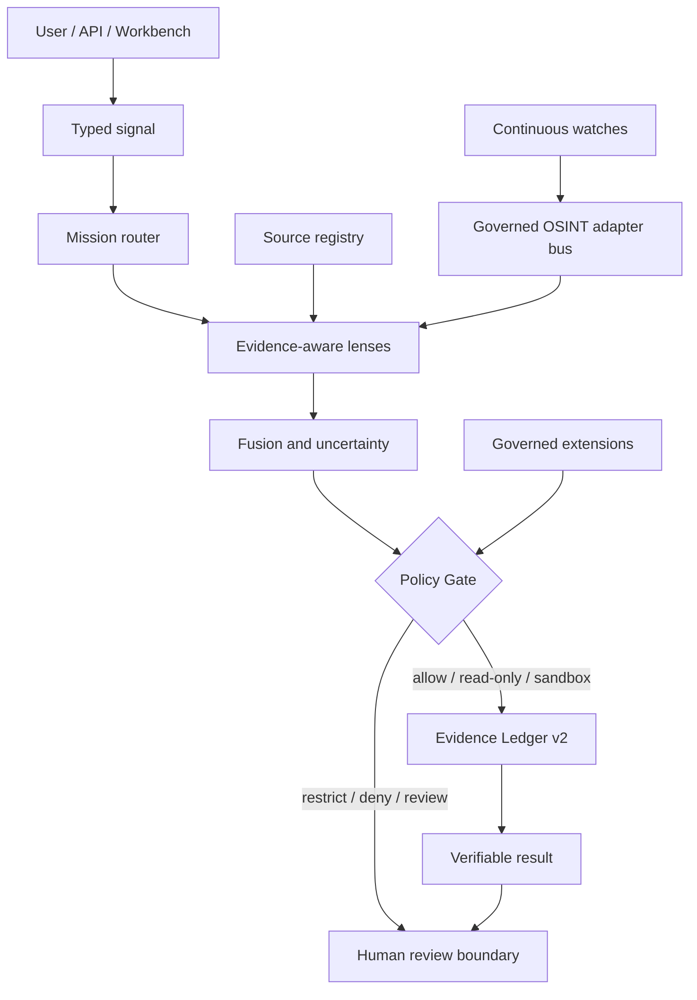

<div align="center">

# DISHA 6.6

### Constitutional Evidence Operating System for governed intelligence, OSINT, geospatial command, and reviewable AI.

**Evidence-first intelligence · Governed OSINT · CTI and SPACEINT source universe · Policy gates · Tamper-evident provenance · Human-reviewable automation**

[](https://github.com/Tashima-Tarsh/Disha/actions/workflows/ci.yml)
[](https://github.com/Tashima-Tarsh/Disha/actions/workflows/codeql.yml)
[](https://github.com/Tashima-Tarsh/Disha/actions/workflows/edge-smoke.yml)


[Project Site](https://thenitishkr.in/disha/) · [Architecture](ARCHITECTURE.md) · [API Reference](docs/internal/api/API_REFERENCE.md) · [Technical Wiki](docs/wiki/Home.md) · [OSINT Governance](docs/osint/GOVERNED_OSINT_EXPANSION.md)

</div>

---

## Executive summary

DISHA is an evidence-first intelligence platform for teams that need more than a chatbot, dashboard, scraper, or collection script.

It is designed for situations where a decision must be explainable after the fact:

- what was asked;
- which public or configured sources were used;
- what the system observed;
- what a model inferred;
- what policy allowed, restricted, or blocked;
- what evidence was written;
- what still requires human review.

The product principle is:

```text
source -> observation -> policy -> evidence -> review -> decision
```

DISHA does not treat model output as evidence. It treats evidence, policy, source provenance, and human review as first-class runtime objects.

## What DISHA is

DISHA is a **Constitutional Evidence Operating System**. The term means that the product is organized around a small set of enforceable operating rules:

1. Every material claim should have a source, evidence event, or review state.
2. Public-source collection must pass through governed adapters.
3. Unsafe, unlicensed, private, leaked, active, or identity-enumeration sources stay blocked by default.
4. AI output is advisory unless backed by traceable evidence.
5. Automation should create reviewable records, not invisible authority.
6. Production capability must be separated from catalog, research, and future integrations.

DISHA is built for public-source intelligence, defensive cyber intelligence, policy and regulatory monitoring, geospatial analysis, source watching, evidence packaging, and accountable AI-assisted workflows.

## What DISHA is not

DISHA does **not** claim to be:

- a government system, law-enforcement system, or official authority;
- an autonomous surveillance platform;
- a leaked-data ingestion product;
- a credential-harvesting or account-enumeration tool;
- a system that can legally or technically access every public and private dataset;
- a product where every cataloged source is automatically executable;
- a replacement for analyst judgment, legal review, or source verification.

This distinction is intentional. DISHA is designed to show what is real, what is configured, what is blocked, and what still needs review.

## Live deployment model

The current hosted architecture separates the public domain, frontend service, and backend intelligence service.

```text
Public URL
  https://disha6.6.thenitishkr.in
        |
        v
Cloudflare Worker edge proxy
  web/cloudflare-proxy.ts
        |
        v
Render web service
  https://disha-v6-web.onrender.com
        |
        v
Optional backend / brain service
  https://disha-v6-brain.onrender.com
```

The Cloudflare Worker route is declared in `web/wrangler.jsonc`. The Worker forwards requests to the Render web origin and adds the `x-disha-edge: cloudflare-render-proxy` header used by the custom-domain smoke workflow.

Render currently hosts:

| Service | Purpose |
| --- | --- |
| `disha-v6-web` | Next.js product, dashboard, workbench, intelligence UI, versioned API routes. |
| `disha-v6-brain` | Python intelligence/research runtime for bounded backend analysis. |

## Product surfaces

| Surface | Purpose |
| --- | --- |
| `/dashboard` | System posture, evidence, geospatial state, source state, readiness, and command overview. |
| `/workbench` | Mission-oriented analyst workflow from question to source routing, policy, evidence, and result. |
| `/intelligence` | Continuous OSINT and public-source watch surface with run history and observations. |
| `/login` | Authenticated entry point. |
| `/api/v1/*` | Versioned product API for missions, evidence, policy, OSINT, source registry, readiness, and extensions. |

## Core architecture


```mermaid
flowchart TD
    U[User / API / Workbench] --> Q[Typed signal]
    Q --> R[Mission router]
    R --> L[Evidence-aware lenses]
    S[Source registry] --> L
    O[Governed OSINT adapter bus] --> L
    W[Continuous watches] --> O
    L --> F[Fusion and uncertainty]
    F --> P{Policy Gate}
    P -->|allow / read-only / sandbox| E[Evidence Ledger v2]
    P -->|restrict / deny / review| H[Human review boundary]
    X[Governed extensions] --> P
    E --> V[Verifiable result]
    V --> H
```

### Runtime ownership

| Runtime | Responsibility |
| --- | --- |
| Next.js / TypeScript | Product UI, API routes, policy gateway, evidence views, source registry, OSINT control plane, workflows. |
| PostgreSQL / PostGIS paths | Durable missions, evidence, source state, watch records, geospatial persistence where configured. |
| Redis / KV paths | Runtime workflow infrastructure where configured. |
| Python Brain | Bounded intelligence and research services behind governed interfaces. |
| Cloudflare Worker | Public custom-domain edge proxy to the Render web service. |
| Render | Hosted web and backend services. |

## What is built now

DISHA separates production capability, configured capability, cataloged sources, and blocked research areas.

| Area | Status | Current implementation |
| --- | --- | --- |
| Product shell | Working | Next.js product with dashboard, workbench, intelligence surface, API routes, authentication path, and command UI. |
| Evidence Ledger v2 | Working | Hash-linked events, previous hash, event hash, payload hash, export path, and verification-oriented records. |
| Policy Gate | Working | Deny-by-default policy decisions for unsafe, unsupported, controlled, or prohibited behavior. |
| Mission orchestration | Working | Signal normalization, lens routing, policy evaluation, evidence writing, and result packaging. |
| Governed OSINT bus | Working | Passive/public-source adapters with declared execution class, purpose, retry/timeout, and evidence output. |
| Universal OSINT Search | Working | Classifies domains, IPs, CVEs, GitHub repositories, SEC CIKs, emails, phones, usernames, and entities; routes only to allowed adapters. |
| Continuous OSINT watches | Working | Watch records, run records, change detection, source bundles, and evidence-bearing observations. |
| OSINT / CTI / SPACEINT source universe | Working catalog | 120+ master directories, public sources, CTI sources, SPACEINT sources, and discovery overlays with access and risk metadata. |
| Restricted-source governance | Working governance surface | DDoSecrets, WikiLeaks, Intelligence X, and DeHashed are visible for governance but non-executable and blocked from ingestion. |
| Service connector posture | Working control plane | OpenCTI and IntelOwl are live-configurable service connectors; SpiderFoot, Sherlock, and Maigret are registered but policy-blocked by default. |
| Geospatial command map | Working / data-dependent | MapLibre-oriented UI and persistence paths; authoritative boundary quality depends on reviewed datasets loaded into deployment. |
| Cloudflare custom domain | Working in smoke CI | Custom-domain smoke verifies public edge and login behavior. DNS propagation remains an operator/domain concern. |
| Full case management | In progress | Durable case lifecycle, approvals, evidence packages, and richer analyst workflows still need hardening. |
| Full production identity | In progress | Authenticated product exists; full OIDC/MFA/WebAuthn production posture is not claimed complete. |
| Disaster recovery and observability | In progress | CI and readiness checks exist; complete DR/SLO/tenant governance are future hardening items. |

## OSINT, CTI, and SPACEINT model

DISHA has two separate layers:

1. **Source universe** — a searchable catalog of sources, directories, datasets, platforms, and discovery locations.
2. **Execution adapters** — reviewed runtime adapters that DISHA is allowed to call.

A source can be cataloged without being executable. This prevents the product from pretending that a linked tool, leak site, paid API, identity-enumeration tool, or active-recon framework is automatically safe to run.

### Source universe examples

The source universe includes:

- OSINT Framework, Bellingcat Toolkit, Start.me pages, IntelTechniques, Awesome OSINT lists, OSINT Map, and GitHub topic discovery;
- search and archives such as Wayback, archive.today, GHDB, reverse-image workflows;
- media verification, geolocation, conflict and humanitarian event sources;
- corporate, financial, sanctions, public-record, and transparency sources;
- CTI sources such as Shodan, Censys, VirusTotal, abuse.ch, OTX, URLScan, MISP, NVD, CVE, CISA KEV, EPSS, MITRE ATT&CK, Malpedia, ransomware trackers;
- SPACEINT sources such as Space-Track, CelesTrak, SatNOGS, UCS, McDowell catalog, Copernicus/Sentinel, Landsat, NASA Worldview, FIRMS, Planet, Maxar, UNOOSA, ITU, NOAA SWPC, and launch warning sources.

### Execution modes

Every source is classified as one of:

| Mode | Meaning |
| --- | --- |
| `builtin` | DISHA has a governed production adapter. |
| `connector_ready` | Safe candidate for a bounded adapter. |
| `requires_configuration` | Requires API keys, credentials, license review, or service deployment. |
| `reference_only` | Analyst discovery/reference only. |
| `blocked_by_default` | Not executable by Universal Search or default runtime. |

### Built-in public-source adapters

Current governed adapters include:

- Google Public DNS-over-HTTPS;
- crt.sh Certificate Transparency;
- RDAP.org;
- Internet Archive Wayback CDX;
- Common Crawl;
- GDELT DOC;
- CISA Known Exploited Vulnerabilities;
- GitHub public repository metadata;
- SEC EDGAR submissions;
- OpenAlex;
- World Bank;
- Wikidata search;
- official public-source probes;
- dynamic public-source adapter for allowlisted registries.

### Service connectors

`GET /api/v1/osint/service-connectors` reports connector posture for:

| Connector | Runtime status |
| --- | --- |
| OpenCTI | Live only when `OPENCTI_BASE_URL` and `OPENCTI_TOKEN` are configured. |
| IntelOwl | Live only when `INTELOWL_BASE_URL` and `INTELOWL_API_KEY` are configured. |
| SpiderFoot | Registered but not executable until a reviewed passive-only module profile exists. |
| Sherlock | Registered but blocked by identity-enumeration policy. |
| Maigret | Registered but blocked by identity-enumeration policy. |

### Restricted-source governance

`GET /api/v1/osint/restricted-sources` exists for governance status only. It does not fetch, store, mirror, search, or return leaked datasets, breach rows, passwords, tokens, secrets, private records, or credential material.

Restricted sources remain visible so an operator can document risk, legal review, and approval state without turning them into executable ingestion adapters.

## API map

Base path:

```text
/api/v1
```

Important routes:

| Route | Purpose |
| --- | --- |
| `GET /api/v1/health` | Service health. |
| `POST /api/v1/mission` | Run a governed mission. |
| `POST /api/v1/agentic/mission` | Agentic mission flow through policy and evidence. |
| `POST /api/v1/policy/evaluate` | Evaluate a policy decision. |
| `GET /api/v1/evidence/{missionId}` | Read evidence for a mission. |
| `POST /api/v1/evidence/export` | Export evidence. |
| `GET /api/v1/sources/registry` | Source registry. |
| `POST /api/v1/sources/probe` | Probe admitted public sources. |
| `GET /api/v1/osint/catalog` | Adapter catalog, GitHub tool catalog, source universe, and continuous capabilities. |
| `GET /api/v1/osint/search?q=<target>` | Governed universal OSINT search. |
| `GET /api/v1/osint/sources` | Search OSINT / CTI / SPACEINT source universe. |
| `GET /api/v1/osint/service-connectors` | OpenCTI, IntelOwl, SpiderFoot, Sherlock, Maigret connector posture. |
| `GET /api/v1/osint/restricted-sources` | Restricted-source governance posture only. |
| `POST /api/v1/osint/run` | Run one governed OSINT adapter for a mission. |
| `GET /api/v1/osint/watches` | List continuous OSINT watches. |
| `POST /api/v1/osint/watches` | Create a watch. |
| `POST /api/v1/osint/watch-bundles` | Create multi-source watch bundles. |
| `GET /api/v1/extensions` | Governed extension registry. |
| `GET /api/v1/production/readiness` | Production readiness posture. |

## Quick start

### Requirements

- Node.js 22.x
- npm
- PostgreSQL for durable production state
- optional PostGIS for geospatial persistence
- optional Redis / KV for workflow infrastructure
- optional Python runtime for Brain and research extensions

### Run the web product locally

```bash
npm install --prefix web
npm --prefix web run dev
```

Open:

```text
http://127.0.0.1:3000/login
http://127.0.0.1:3000/dashboard
http://127.0.0.1:3000/workbench
http://127.0.0.1:3000/intelligence
```

### Verify the product

```bash
npm --prefix web run type-check:full
npm --prefix web test
npm --prefix web run build
```

### Verify Python components

```bash
python -m pip install -r disha/brain/requirements.txt pytest
python -m pytest tests/test_disha_brain_graph.py skills/vyuha-defense-engine/tests
```

### Docker development

```bash
docker compose up --build web
```

Full research profile:

```bash
docker compose --profile full up --build
```

## Environment configuration

Common variables include:

| Variable | Purpose |
| --- | --- |
| `DISHA_JWT_SECRET` | Signs application sessions. Required for production. |
| `DISHA_DEV_PASSWORD` | Local/dev password path. Use a strong value. |
| `DATABASE_URL` | PostgreSQL connection string. |
| `REDIS_URL` | Optional Redis/workflow infrastructure. |
| `DISHA_INTERNAL_WEB_URL` | Internal URL used by dynamic worker/runtime paths. |
| `OPENCTI_BASE_URL` / `OPENCTI_TOKEN` | Optional OpenCTI service connector. |
| `INTELOWL_BASE_URL` / `INTELOWL_API_KEY` | Optional IntelOwl service connector. |
| `CLOUDFLARE_API_TOKEN` / `CLOUDFLARE_ACCOUNT_ID` | Optional GitHub Actions deployment of Cloudflare Worker. |

Do not commit secrets. Configure deployment secrets through the hosting provider and GitHub Actions secrets.

## Repository map

| Path | Responsibility |
| --- | --- |
| `web/app/` | Product pages and API routes. |
| `web/lib/unified/` | Core contracts, orchestration, policy, evidence, source registry, OSINT, watches, service connectors. |
| `web/lib/extensions/` | Governed extension adapters. |
| `web/components/` | Product UI components including intelligence and geospatial surfaces. |
| `web/database/` | Database migrations and persistence schemas. |
| `web/tests/` | TypeScript/Vitest regression tests. |
| `disha/brain/` | Python Brain service. |
| `skills/vyuha-defense-engine/` | Defensive-intelligence source package and tests. |
| `docs/osint/` | Governed OSINT design and integration guidance. |
| `docs/wiki/` | In-repository technical wiki. |
| `docs/internal/` | Product, architecture, roadmap, API, and readiness docs. |
| `.github/workflows/` | CI, CodeQL, DB migration verification, Cloudflare edge deploy, custom-domain smoke. |

## Engineering rule for new capability

A new capability is not production-ready because it exists in a repo, appears in a list, or can be called from code.

To promote a capability into DISHA production, it must satisfy:

```text
contract -> policy -> evidence -> test -> documentation
```

The minimum review checklist is:

1. Define the capability and allowed purpose.
2. Declare source, license, terms, and access requirements.
3. Classify execution behavior: passive, credentialed API, active recon, identity enumeration, restricted, or prohibited.
4. Add policy handling before runtime execution.
5. Add timeouts, retries, input validation, and result limits.
6. Convert outputs into evidence/provenance records.
7. Add tests proving both allowed and blocked behavior.
8. Update API/docs/readiness status.

## Current production posture

| System | Status |
| --- | --- |
| Product CI | Active. |
| CodeQL | Active. |
| Database migration verification | Active. |
| Cloudflare custom-domain smoke | Active. |
| Render web service | Active deployment target. |
| Render brain service | Active deployment target. |
| Cloudflare Worker proxy | Configured in repo; deploy depends on Cloudflare credentials or external integration. |
| Source universe | Active catalog. |
| Live OSINT execution | Passive/public by default. |
| Restricted sources | Governance-only, non-executable. |
| Identity enumeration | Blocked by default. |
| Active reconnaissance | Blocked by default unless separately reviewed and sandboxed. |

## Documentation

Start here:

- [Technical Wiki](docs/wiki/Home.md)
- [Architecture](ARCHITECTURE.md)
- [API Reference](docs/internal/api/API_REFERENCE.md)
- [Governed OSINT Expansion](docs/osint/GOVERNED_OSINT_EXPANSION.md)
- [Roadmap](docs/internal/ROADMAP.md)

## Operating philosophy

DISHA is built for responsible intelligence work.

The product is strongest when it keeps uncomfortable distinctions visible:

- known versus inferred;
- sourced versus unsourced;
- public versus restricted;
- configured versus cataloged;
- automated versus human-reviewed;
- evidence versus model output.

The goal is not to make an intelligence system look powerful. The goal is to make it **auditable, governable, and useful when the answer matters**.
