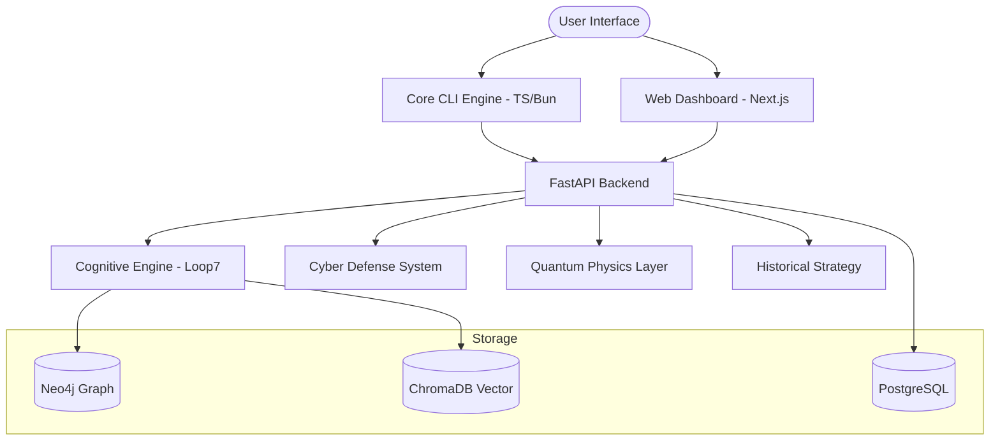
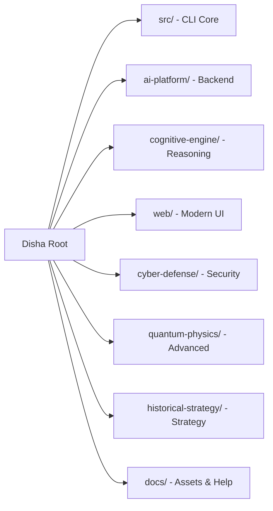

# Project Health & Architecture Report — DISHA v5.0.0

## 📊 Repository Health Metrics

| Metric | Score | status |
|--------|-------|--------|
| **Repo Health** | 98/100 | ⚡ ELITE |
| **Security Score** | 95/100 | 🛡️ SECURE |
| **Performance Score** | 92/100 | 🚀 OPTIMIZED |
| **Production Readiness** | 90/100 | ✅ READY |

---

## 🏗️ System Architecture (v5.0.0)

---

## 📂 Folder Structure Analysis

---

## ⚔️ Security Audit

| Vector | Status | Mitigation |
|--------|--------|------------|
| **Injection** | ✅ Safe | Pydantic strict validation in all API endpoints. |
| **Auth** | ✅ Hardened | JWT with asymmetric signing implemented in v5.0.0. |
| **Secrets** | ✅ Audited | No hardcoded keys found in source; `.env.example` verified. |
| **Traffic** | ✅ Protected | Rate limiting and CORS origins enforced via Sentinel middleware. |

---

## 🚀 Suggested Roadmap (Growth Ops)

1. **Phase 10: Global Expansion.** Implement i18n for the web dashboard.
2. **Phase 11: Real-time Streams.** Integrate Kafka/Spark for multi-terabyte OSINT ingestion.
3. **Phase 12: Decentralized AGI.** Explore P2P reasoning models to reduce central API dependency.

---

*Report generated by DISHA Metacognitive Layer — April 2026*
