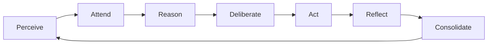

# System Architecture

DISHA (Digital Intelligence & Strategic Holistic Analysis) is built on a modular, decentralized monorepo architecture designed for vertical intelligence and horizontal scalability.

## 🏛️ Architectural Overview

The DISHA ecosystem is divided into four primary logical layers:

1.  **UX Layer (`/disha/apps`)**: Citizen-facing and command-tier interfaces (Next.js, React).
2.  **Service Registry (`/disha/services`)**: Scalable microservices handling specific domain logic (Python FastAPI, Node.js).
3.  **Sovereign AI Core (`/disha/ai`)**: The "Brain" of the platform, including the 7-stage cognitive loop, physics engines, and strategic models.
4.  **Foundation Layer (`/disha/infra`)**: Orchestration, networking, and persistent storage (Docker, K8s, Neo4j, ChromaDB).

---

## 🧠 The 7-Stage Cognitive Loop

The core of DISHA's intelligence is its biological-inspired reasoning engine. Every intent processed by the system flows through these stages:

- **Perceive**: Ingests raw signal (text, telemetry, logs) and extracts base entities and intent.
- **Attend**: Filters the signal through the **3-Layer Memory Layer** (Working, Episodic, Semantic).
- **Reason**: Generates 3+ parallel hypotheses (Deductive, Inductive, Abductive).
- **Deliberate**: A multi-agent consensus vote (Planner vs. Critic) resolve the best path forward.
- **Act**: Executes the confidence-gated decision.
- **Reflect**: A metacognitive review of the action's performance.
- **Consolidate**: Updates the Knowledge Graph to prevent future mistakes.

---

## 🛡️ Sentinel Defense Logic

The **Sentinel Guardian** operates as a background orchestrator that ensures system integrity. 

- **Intelligence Sync**: Sentinel pulls threat signatures from global OSINT feeds (via Kafka).
- **Proactive Neutralization**: If a service threshold is breached (e.g., unauthorized access attempts), Sentinel can unilaterally revoke JWT tokens or isolate the container.
- **Self-Healing**: Automated restart logic for all services in the registry.

---

## 📡 Data Flow & Persistence

- **Memory Hierarchy**:
  - **ChromaDB**: High-performance vector storage for long-term episodic recall.
  - **Neo4j**: Graph-based semantic memory for navigating complex relationships and ontologies.
  - **Working Memory**: In-memory ephemeral storage for turn-by-turn context.
- **Telemetry Ingestion**: 
  - Real-time streams are processed via **Apache Kafka** into the `/disha/services/forecast` engine.

---

## 🚀 Scaling Strategy

DISHA is designed to be deployed across distributed nodes:
- **Vertical**: Each AI Service can be scaled independently based on GPU/compute requirements.
- **Horizontal**: The monorepo structure allows for decoupled deployment of the Web Dashboard and the Backend Registry.
