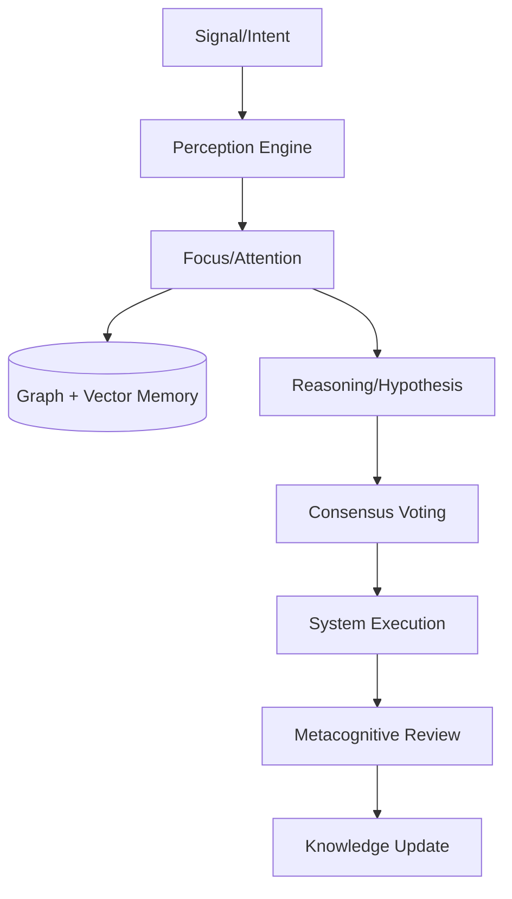

# System Architecture Deep-Dive

DISHA v6.0.0 is a **Decentralized Sovereign Monorepo**. It moves away from the legacy monolithic structure towards a cluster-based registry of services.

## 🏛️ Functional Layers

### 1. Root Orchestrator
The root repository coordinates the workspaces using **Bun**. It manages dependencies across the `apps/`, `services/`, and `ai/` clusters.

### 2. Service Registry (`/disha/services`)
Each service is a decoupled entity exposing a FastAPI or Node.js endpoint. Services include:
- **Alerts**: Real-time incident broadcasting.
- **Forecast**: Predictive national telemetry.
- **MCP**: Tool-calling interoperability server.
- **OSINT**: High-frequency intelligence ingestion.

### 3. Intelligence Core (`/disha/ai`)
The "Sovereign Brain" contains the model weights, reasoning logic, and simulation engines. This is where the **7-Stage Cognitive Loop** is executed.

---

## 📡 Data Flow Diagram

---

## 📁 Repository Layout Walkthrough

| Directory | Content |
|:--- |:--- |
| **`/disha/apps/web`** | Elite Next.js 16 Command Dashboard. |
| **`/disha/services/ai-platform`** | Unified reasoning backend. |
| **`/disha/ai/core`** | Implementation of DISHA-MIND. |
| **`/disha/ai/physics`** | Project SETU (Structure) & VARUNA (Weather). |
| **`/disha/scripts`** | Mythos (Orchestrator) & Continuous Train. |

For a line-by-line guide, see the [Repository Walkthrough](../REPO_WALKTHROUGH.md).
