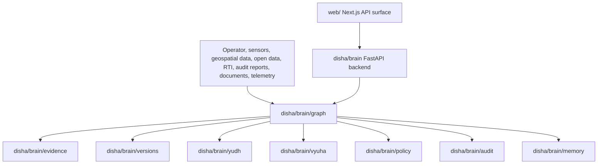

# Architecture

DISHA is organized around a production spine and several legacy or experimental surfaces.

## Production Spine

## Repository Map

- `disha/brain/`: central reasoning, graph, policy, evidence, memory, audit, monitoring, database, and FastAPI surfaces.
- `web/`: hardened Next.js API surface for auth, audit, agent workflows, files, export, and sharing.
- `src/`: TypeScript CLI/runtime hardening modules and MCP entrypoint.
- `demos/`: JSON examples for the six DISHA versions.
- `tests/`: focused tests for the graph spine.
- `legacy/`, `disha/services/`, `disha/ai/`, and integrations: useful but not automatically production-trusted.

## Result Contract

Every graph result returns version, evidence class, source list, confidence level, risk score, reasoning summary, Yudh assessment, Vyuha recommendation, NFU policy status, human approval requirement, final recommendation, and audit event.

## Safety Boundary

No-First-Use is enforced before recommendation finalization. DISHA may recommend defensive monitoring, containment, evidence preservation, alerting, reporting, and recovery. It may not recommend retaliation, unauthorized access, malware, DDoS, brute forcing, exploitation, or third-party attack.

## Integration Direction

The graph is currently callable as Python code. The next production step is to expose a narrow FastAPI endpoint that accepts `GraphInput`, authenticates the caller, writes audit records to persistent storage, and returns `DishaGraphResult`.

