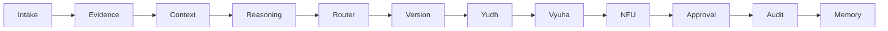

# LangGraph-Style Agentic Flow

The current graph is deterministic and dependency-light. It follows the same state-passing discipline expected from a LangGraph-style architecture without requiring the LangGraph package.

State is defined in `disha/brain/graph/state.py`. The graph is invoked through `DishaAgenticGraph.invoke(GraphInput(...))`.

The graph returns a typed `DishaGraphResult`, not free-form text.

