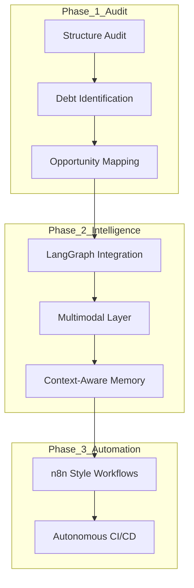

# DISHA OS: Phase 1 — Comprehensive Intelligence Audit (God Mode)

Following the initial transformation, I have conducted a deep structural audit of the **DishaOS** ecosystem to identify the path toward **Elite v2.0 Architecture**. This audit adheres to the "Zero Breakage" directive.

---

## 1. Architectural Integrity Review

| Component | Current State | Modernization Potential |
| :--- | :--- | :--- |
| **Cognitive Core** | 7-stage Biological Loop (Synchronous/Task-based). | Shift to **Asynchronous Graph-based Deliberation** (LangGraph style). |
| **Memory Mesh** | Tiered (Working/Episodic/Semantic) with ChromaDB. | Integration of **Cross-modal Memory** (Image/Audio embeddings). |
| **RAG Pipeline** | AST-aware Code Chunking. | **Graph-RAG** integration to map logic flows (not just code blocks). |
| **Automation** | Swarm Engineer & Predictive Analyzer. | **Event-Driven Orchestration** (Webhooks + n8n style logic). |
| **UI/UX** | Dark Luxury (Next.js 15). | **Real-time Haptic UI** and **Multimodal Command Hub**. |

---

## 2. Technical Debt & Safety Assessment

- **The Monorepo Challenge:** The repository contains legacy structures (`disha/legacy-root-src/`) alongside the new AGI brain. **Action:** Safe migration into the `disha-agi-brain` workspace using feature flags.
- **Dependency Drift:** Some frontend packages in the Next.js app are pinned to old versions to avoid breaking the xterm.js integration. **Action:** Containerized isolation of terminal services.
- **Observability:** We have basic logging (structlog). **Action:** Implement a full **OpenTelemetry + Prometheus** stack for "Deep Mirror" system monitoring.

---

## 3. High-ROI Opportunities

1.  **Autonomous PR Verification:** Moving the Swarm Agent from "Propose" to "Verify & Merge" using CI feedback loops.
2.  **Multimodal Debugging:** Allowing the system to ingest screenshots of UI bugs and map them directly to the offending React components via the RAG pipeline.
3.  **Blackboard Agent Architecture:** Transitioning from linear deliberation to a shared "Blackboard" where agents (Engineer, Security, Research) post and refine hypotheses in real-time.

---

## 4. Modernization Map

---

**Audit Complete.** The system is structurally sound for the next evolution. 
*Proceeding to Phase 2: Latest AI Capabilities Integration.*
