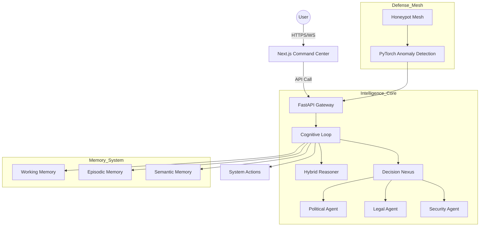
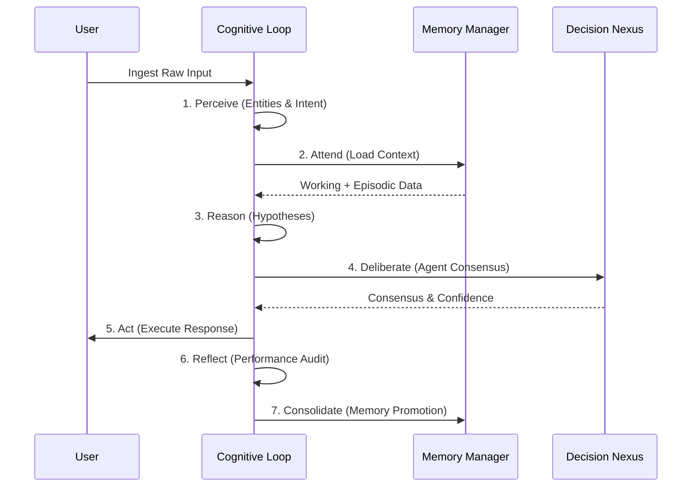
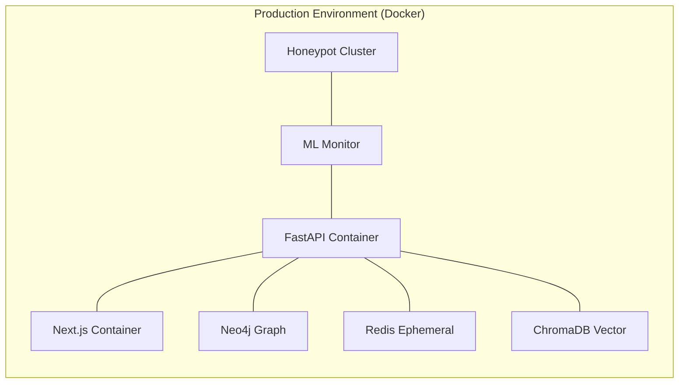
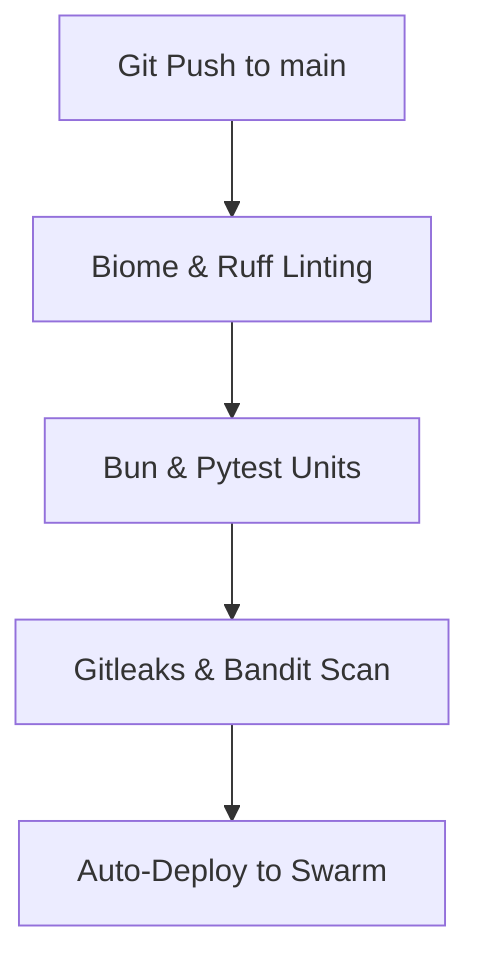

# DISHA OS: Visual Architecture Documentation

This document contains high-fidelity Mermaid diagrams representing the technical workflows and structures of the DISHA platform.

---

## 1. System Architecture (High-Level)

---

## 2. The 7-Stage Intelligence Turn

---

## 3. Deployment Topology

---

## 4. CI/CD Flow

