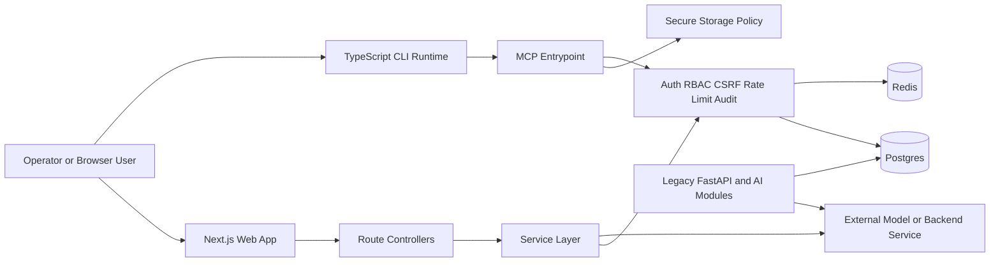
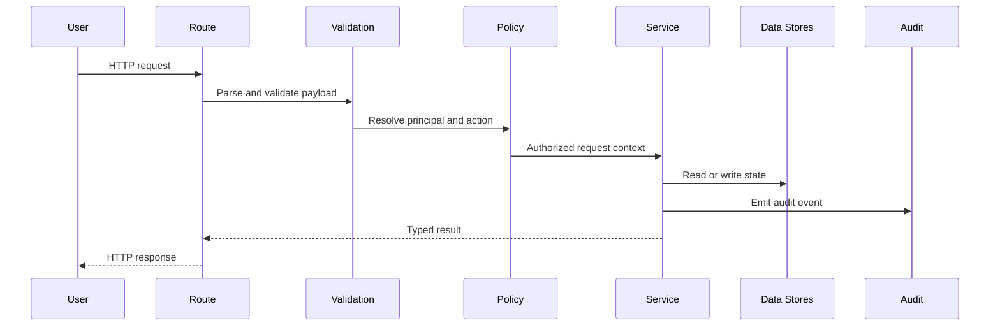
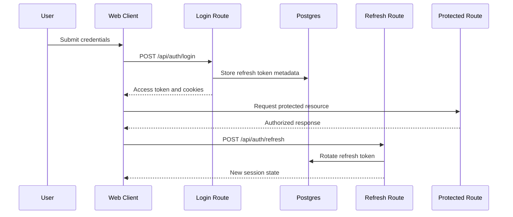
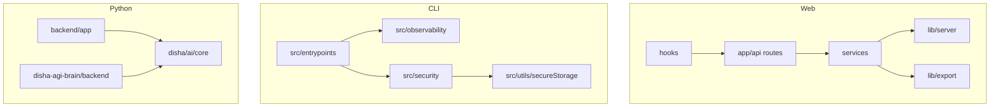

# Architecture Diagrams

## Rendering

The Mermaid blocks in this document can be rendered:

- directly in GitHub markdown
- in Mermaid Live Editor for export to PNG or SVG
- in documentation generators that support Mermaid

For image export, paste the diagram into Mermaid Live Editor, choose `PNG` or `SVG`, and save to `docs/images/`.

## System Architecture

## Data Flow

## Auth Flow

## Component Diagram

