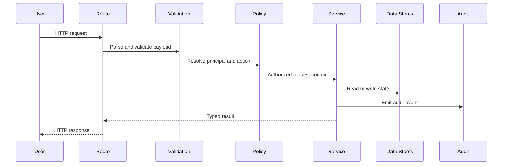
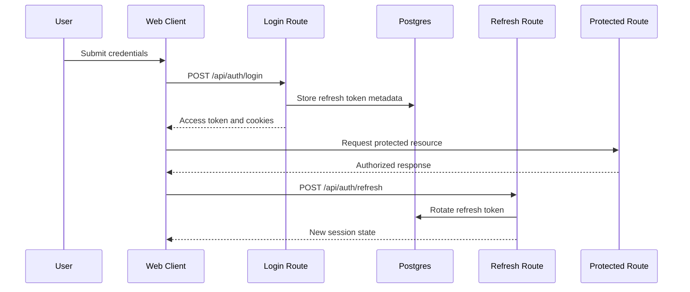
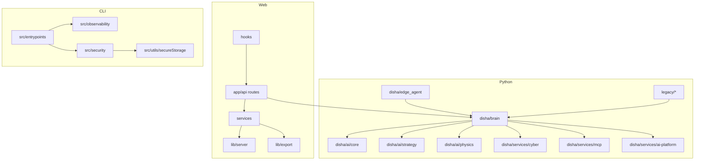

# Architecture Diagrams

## Rendering

The Mermaid blocks in this document can be rendered:

- directly in GitHub markdown
- in Mermaid Live Editor for export to PNG or SVG
- in documentation generators that support Mermaid

For image export, paste the diagram into Mermaid Live Editor, choose `PNG` or `SVG`, and save to `docs/images/`.

## System Architecture

Premium poster (SVG):

- `docs/images/disha-brain-platform-premium.svg`

```mermaid
flowchart LR
    User[Operator or Browser User]
    Web[Next.js Web App]
    Brain[DISHA Brain API]
    API[Route Controllers]
    Services[Service Layer]
    Security[Auth RBAC CSRF Rate Limit Audit]
    Postgres[(Postgres)]
    Redis[(Redis)]
    Modules[Subsystem Modules]
    Model[External Model Providers]
    CLI[TypeScript CLI Runtime]
    MCP[MCP Entrypoint]
    Storage[Secure Storage Policy]
    Legacy[Legacy and Prototypes (legacy/)]

    User --> Web
    Web --> API
    API --> Services
    Services --> Security
    Services --> Brain
    Security --> Postgres
    Security --> Redis
    Brain --> Modules
    Modules --> Model

    User --> CLI
    CLI --> MCP
    MCP --> Storage
    MCP --> Security
    MCP --> Brain

    Legacy --> Modules
```

## Data Flow



## Auth Flow



## Component Diagram


