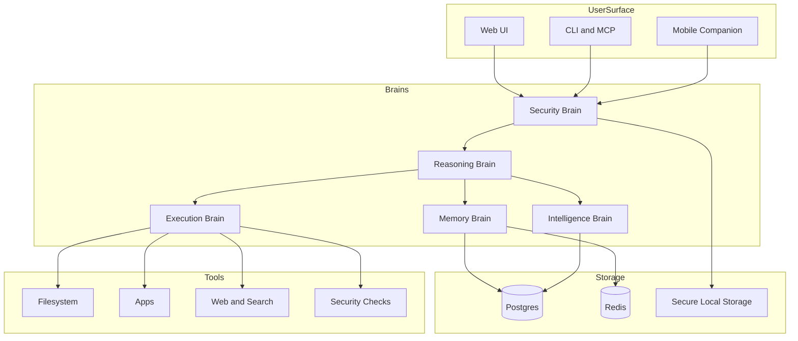
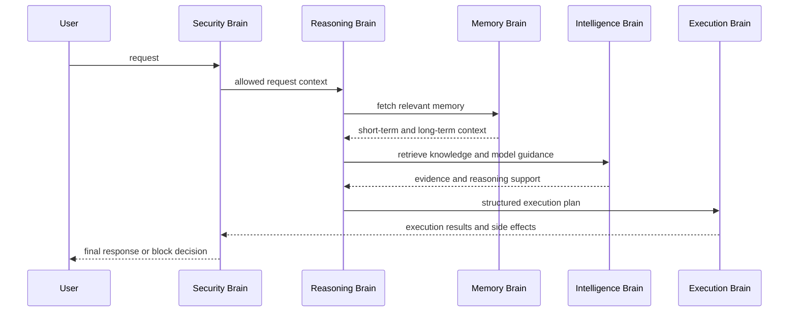

# JARVIS-X Architecture

## Overview

JARVIS-X is the target multi-brain assistant architecture for DISHA. It combines reasoning, execution, memory, security, and intelligence into a single privacy-first personal AI system.

This design is grounded in the current repository rather than a hypothetical greenfield platform. The goal is to evolve existing DISHA modules into a unified agent runtime.

## Design Goals

- unify the repository around one personal AI architecture
- preserve zero-trust and audit-first controls
- support tool execution without unsafe autonomy
- maintain short-term and long-term memory with explicit consent boundaries
- keep the implementation realistic across web, CLI, and Python service surfaces

## Core Modules

### 1. Reasoning Brain

Purpose:
Turn user intent into plans, task trees, and execution strategies.

Primary responsibilities:

- interpret goals
- break tasks into steps
- decide whether a task requires tools, memory, or external knowledge
- monitor task completion and recover from failures

Repo alignment:

- `disha/ai/core/cognitive_loop.py`
- `disha/ai/core/agents/deliberation.py`
- `disha/ai/core/intelligence/hybrid_reasoner.py`
- `backend/app/agents/orchestrator.py`

Target output:

- normalized intent
- step plan
- risk class
- execution mode

### 2. Execution Brain

Purpose:
Run approved actions through controlled tools and applications.

Primary responsibilities:

- invoke filesystem, app, web, and security tools
- sequence actions with retries and bounded side effects
- report structured results back to the Reasoning Brain

Repo alignment:

- `src/entrypoints/mcp.ts`
- `web/services/chat.ts`
- `web/services/filesystem.ts`
- `backend/app/services/automation/`

Target output:

- tool invocation records
- structured result payloads
- execution traces

### 3. Memory Brain

Purpose:
Store short-term context and long-term user preferences while preserving privacy.

Primary responsibilities:

- maintain working session context
- store user preferences and durable memory
- retrieve only relevant memory for current tasks
- support deletion, TTL, and scoped recall

Repo alignment:

- `disha/ai/core/memory/working.py`
- `disha/ai/core/memory/episodic.py`
- `disha/ai/core/memory/semantic.py`
- `web/database/schema.sql`
- `web/lib/server/db.ts`
- `web/lib/server/redis.ts`

Target output:

- active context window
- preference profile
- relevant historical recall

### 4. Security Brain

Purpose:
Gate unsafe actions, detect suspicious behavior, and enforce trust boundaries.

Primary responsibilities:

- verify identity and role
- classify command risk
- enforce filesystem and tool policies
- detect suspicious sequences, prompt injection, and data exfiltration attempts
- produce audit-grade event trails

Repo alignment:

- `web/lib/server/security.ts`
- `web/lib/server/policy.ts`
- `web/lib/server/auth.ts`
- `web/lib/server/csrf.ts`
- `web/lib/server/rate-limit.ts`
- `src/security/secureStoragePolicy.ts`
- `src/observability/audit.ts`

Target output:

- allow, deny, require-confirmation, or sandbox decision
- risk classification
- audit event

### 5. Intelligence Brain

Purpose:
Provide knowledge retrieval, model routing, and domain reasoning.

Primary responsibilities:

- choose model or backend for a task
- retrieve repository, user, or external knowledge
- validate AI outputs
- return explainable evidence or fallback results

Repo alignment:

- `disha/ai/core/api/`
- `disha/ai/core/citation_engine.py`
- `disha/ai/core/ast_indexer.py`
- `disha/ai/core/decision_engine/`
- `disha-agi-brain/backend/app/services/router.py`
- `disha-agi-brain/backend/app/services/local_ai.py`

Target output:

- answer or recommendation
- citations or supporting evidence
- model metadata
- confidence score

## Unified Interaction Flow

```text
User Input
  -> Security Brain pre-check
  -> Reasoning Brain intent parse
  -> Plan generation
  -> Memory Brain context injection
  -> Intelligence Brain retrieval/model selection
  -> Execution Brain action run
  -> Security Brain post-check and audit
  -> Result synthesis
  -> Memory Brain update
  -> User Response
```

## Runtime Pipeline


## Tool System

### File System Tools

Capabilities:

- read file
- write file
- list directory
- search repository content

Controls:

- workspace-root enforcement
- path traversal prevention
- size limits
- audit events

Repo alignment:

- `web/services/filesystem.ts`
- `web/lib/server/security.ts`

### App Tools

Capabilities:

- launch approved local apps
- route through MCP or OS integration
- open allowed project surfaces

Controls:

- allowlist-based execution
- user confirmation for privileged actions
- per-device policy

Repo alignment:

- `src/entrypoints/mcp.ts`

### Web And Search Tools

Capabilities:

- fetch reference content
- search trusted sources
- summarize or compare findings

Controls:

- domain policy
- sensitive-query filtering
- result provenance logging

Repo alignment:

- use `web/services/chat.ts` as the request orchestration boundary
- use `disha/ai/core` retrieval components for future repository-aware search

### Security Tools

Capabilities:

- policy evaluation
- environment validation
- secure storage checks
- suspicious pattern detection

Controls:

- always-on
- cannot be bypassed by user prompts alone

Repo alignment:

- `web/lib/server/policy.ts`
- `src/security/secureStoragePolicy.ts`

## Memory Design

### Short-Term Memory

Storage:

- in-request context
- session context in Redis
- bounded task state

Use cases:

- current conversation state
- active plan
- pending tool results

### Long-Term Memory

Storage:

- Postgres for preferences and durable history
- optional vector or semantic layer later

Use cases:

- user preferences
- recurring workflows
- trusted defaults
- project-specific history

### Privacy-First Rules

- memory is scoped by user and workspace
- sensitive data is redacted before logging
- users can delete long-term memory entries
- memory writes should be explainable and revocable

## Security Layer

### Command Verification

Every command should be classified before execution:

- low risk: read-only actions
- medium risk: local writes within workspace
- high risk: credential, network, or destructive actions

### Unsafe Action Prevention

The system must:

- block destructive file actions outside policy
- prevent secret disclosure
- reject hidden prompt-based tool escalation
- require confirmation for sensitive operations

### Suspicious Pattern Detection

Examples:

- repeated attempts to access secrets
- path traversal patterns
- requests to disable audit or policy systems
- unusual cross-workspace access

## Cross-Device Design

### Devices

- laptop as primary orchestration node
- mobile as companion control surface

### Sync Model

- encrypted session sync metadata
- user profile and preferences stored server-side
- device-local secure credentials remain local when possible

### Communication

- TLS for transport
- signed session tokens
- refresh token rotation
- per-device session inventory and revocation

## AI Behavior Model

### Explain Decisions

JARVIS-X should report:

- what it understood
- what plan it chose
- why a tool was or was not used
- why an action was blocked when applicable

### Adapt Over Time

Adaptation should happen through:

- remembered preferences
- recurring workflow recognition
- safer defaults from prior approvals

Adaptation must not:

- silently weaken security policy
- retain sensitive material without explicit reason

### Maintain Consistency

Consistency should come from:

- stable system policies
- explicit planning outputs
- structured memory recall
- validated execution responses

## Architecture Diagram



## Module Interaction Diagram



## Recommended Repo Mapping

### Phase 1: Compose Existing Pieces

- use `web/` as the authenticated control plane
- use `src/` as the secure execution and MCP gateway
- use `disha/ai/core` as the reasoning and memory substrate
- keep `backend/` and `disha-agi-brain/` as legacy supporting surfaces until consolidated

### Phase 2: Converge Into Target Structure

```text
platform/
  web/
  cli/
brains/
  reasoning/
  execution/
  memory/
  security/
  intelligence/
services/
  auth/
  sync/
  storage/
  tools/
```

### Phase 3: Harden

- introduce a single event bus for brain-to-brain communication
- unify audit events across web, CLI, and Python modules
- add per-device trust inventory
- add explicit consent gates for persistent memory writes

## Example Workflows

### Workflow 1: Summarize A Project File

1. User asks for a summary of a file.
2. Security Brain verifies read access.
3. Reasoning Brain classifies task as read-only.
4. Execution Brain reads file through filesystem tool.
5. Intelligence Brain summarizes with evidence.
6. Memory Brain records lightweight session context.

### Workflow 2: Modify A Repository File

1. User asks for a code change.
2. Security Brain verifies workspace scope.
3. Reasoning Brain creates a patch plan.
4. Memory Brain injects project context and prior preferences.
5. Execution Brain applies patch and runs validation.
6. Security Brain logs write action and result.

### Workflow 3: Suspicious Command Attempt

1. User or injected content requests access outside workspace or asks to reveal secrets.
2. Security Brain classifies request as high risk.
3. Execution Brain is not invoked.
4. Reasoning Brain returns a safe explanation.
5. Audit event is recorded.

## Implementation Notes

- keep each brain as a bounded module with typed inputs and outputs
- move toward event-driven coordination rather than tightly coupled direct calls
- centralize policy evaluation in the Security Brain instead of duplicating checks
- use Postgres for durable memory and Redis for active session state
- keep local device secrets in secure local storage, not shared durable memory

## Final Recommendation

For this repository, JARVIS-X should not be built as a brand-new standalone stack. It should be implemented as a convergence architecture:

- `web/` becomes the secure operator shell
- `src/` becomes the execution gateway
- `disha/ai/core` becomes the reasoning and memory kernel
- `web/lib/server` plus `src/security` become the Security Brain foundation
- legacy Python services are absorbed selectively as specialized intelligence or execution components
