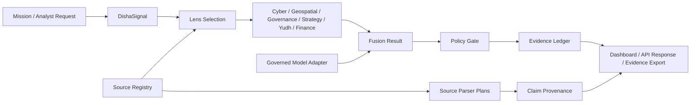

# Architecture

DISHA is architected as one governed mission pipeline, not a collection of disconnected AI demos.

## Runtime Layers

| Layer | Path | Responsibility |
| --- | --- | --- |
| User surface | `web/app` | UI, app routes, product experience |
| API v1 | `web/app/api/v1` | Product endpoints and contracts |
| Contracts | `web/lib/unified/contracts.ts` | Shared typed product language |
| Orchestrator | `web/lib/unified/orchestrator.ts` | Mission execution path |
| Lenses | `web/lib/unified/lenses.ts` | Domain-specific analysis |
| Policy gate | `web/lib/unified/policy-gate.ts` | Safety and action boundary |
| Evidence ledger | `web/lib/unified/evidence-ledger.ts` | Traceable evidence record |
| Source registry | `web/lib/unified/source-registry.ts` | Source truth boundary |
| Source ingestion | `web/lib/unified/source-ingestion.ts` | Controlled data intake |
| Claim provenance | `web/lib/unified/claim-provenance.ts` | Dashboard-safe proof chain |
| Production spine | `web/lib/unified/production-spine.ts` | Readiness and product coherence |

## Architecture Diagram



## Architectural Rules

| Rule | Meaning |
| --- | --- |
| Contract first | Runtime behavior must map to typed DISHA contracts. |
| Policy before action | Sensitive outputs pass through the policy gate. |
| Evidence before output | Claims must carry provenance or remain unverified. |
| Archive is not product | Legacy code is source material until promoted. |
| Public docs are separate | Public pages must not publish private runtime state. |

## Promotion Gate

No model, parser, legacy module, or dashboard value becomes production unless it passes through:

```text
contract -> policy -> evidence -> test
```

## Archive Boundary

Folders such as `legacy/`, older app folders, and integration archives are promotion candidates only. They are not active production runtime unless explicitly wired into the v6.6 contracts and tests.
