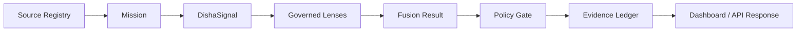

# System Overview

DISHA v6.6 is a source-first intelligence product. It receives a mission, normalizes it into a typed signal, runs governed lenses, evaluates policy, records evidence, and returns an auditable result.

## Positioning

| DISHA Is | DISHA Is Not Yet |
| --- | --- |
| A constitutional evidence workbench | A certified legal authority |
| A governed intelligence pipeline | A complete 2012-2026 crime statistics database |
| A source provenance and evidence system | A live surveillance system |
| A policy-gated agent runtime foundation | An autonomous action system |
| A public-sector analytics foundation | A fully parsed government data warehouse |

## Active Surfaces

| Surface | Role |
| --- | --- |
| `web/` | Active Next.js product runtime |
| `web/app/api/v1` | Mission, data, policy, evidence, health, and architecture APIs |
| `web/lib/unified/contracts.ts` | Typed DISHA contracts |
| `web/lib/unified/orchestrator.ts` | Mission orchestration |
| `web/lib/unified/policy-gate.ts` | Sensitive-output control |
| `web/lib/unified/evidence-ledger.ts` | Evidence chain |
| `web/lib/unified/source-registry.ts` | Official/public source registry |
| `docs/public/` | Public documentation page |

## Product Flow



## Operating Categories

DISHA combines:

- civic intelligence workbench,
- source provenance system,
- policy-gated agent runtime,
- claim verification infrastructure,
- public-sector analytics foundation,
- public/private documentation boundary.

## Active Verification

Run:

```bash
npm run verify
```

This runs TypeScript checks, tests, and the production build.
