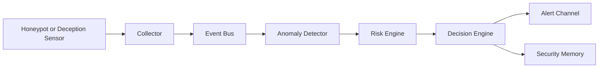
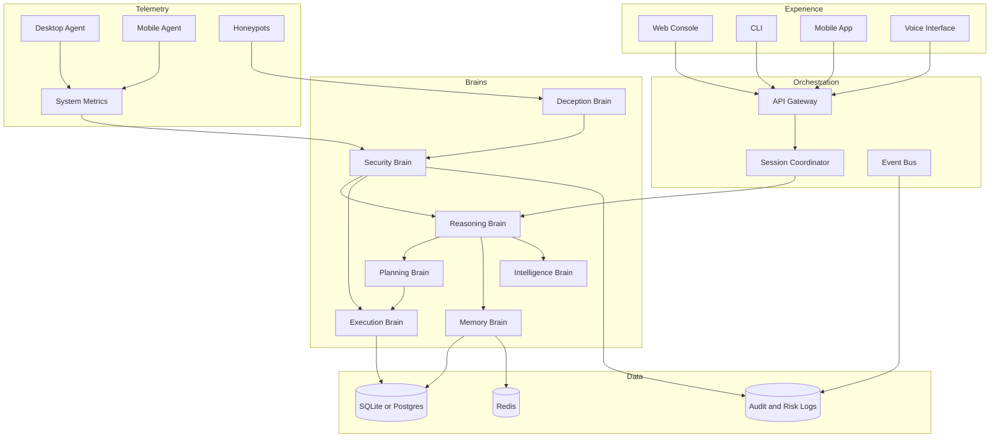
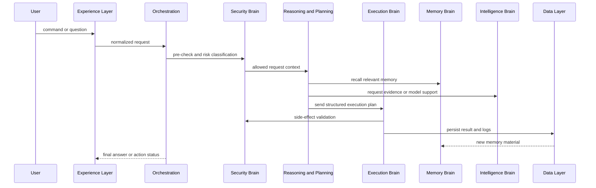
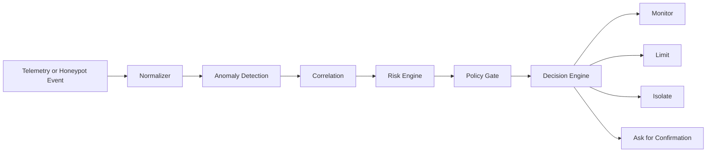

# JARVIS-X Enterprise Architecture

## Purpose

This document defines the complete repository architecture for DISHA when organized around JARVIS-X as the primary intelligent control plane.

The design follows an enterprise reference style:

- layered responsibilities
- explicit trust boundaries
- modular brain system
- defensive security controls
- deception and honeypot telemetry as part of the security intelligence loop

This is a realistic target architecture for the existing repo. It does not assume AGI or autonomous offensive behavior.

## Executive Summary

JARVIS-X should be the orchestration layer that sits across the repo and turns DISHA into one coherent platform:

- `web/` becomes the secure operator interface
- `src/` becomes the trusted execution gateway
- `disha/ai/core` becomes the reasoning and memory kernel
- `backend/` and `disha-agi-brain/` become specialized backend and intelligence services
- deception sensors and honeypots become a telemetry source for the Security Brain

## Layered Architecture

### Layer 1: Experience Layer

Purpose:
All user-facing interaction surfaces.

Components:

- web operator console
- CLI
- mobile companion
- voice entry and notification surfaces

Repo alignment:

- `web/`
- `src/`
- `jarvis-x/mobile/`

Responsibilities:

- collect user input
- present decisions and alerts
- request explicit confirmation for high-risk actions

### Layer 2: Orchestration Layer

Purpose:
Route work across the internal brains and maintain end-to-end workflow state.

Components:

- request router
- session coordinator
- event workflow manager
- action queue

Repo alignment:

- `jarvis-x/backend/api/`
- `jarvis-x/backend/event_bus.py`
- `backend/app/agents/orchestrator.py`

Responsibilities:

- convert requests into internal work units
- coordinate brain-to-brain communication
- maintain task lifecycle and correlation ids

### Layer 3: Cognitive Brain Layer

Purpose:
Structured planning, reasoning, memory, and intelligence.

Sub-brains:

- Reasoning Brain
- Planner
- Execution Brain
- Memory Brain
- Intelligence Brain
- Security Brain

Repo alignment:

- `jarvis-x/backend/brain/`
- `disha/ai/core/`

Responsibilities:

- understand goals
- build plans
- retrieve context
- execute actions safely
- explain decisions

### Layer 4: Security and Deception Layer

Purpose:
Continuously protect the system with policy enforcement, risk scoring, anomaly analysis, and deception telemetry.

Components:

- token auth and session validation
- RBAC and request policy
- safe execution policy
- anomaly detector
- risk engine
- decision engine
- deception and honeypot collectors
- audit and alert pipeline

Repo alignment:

- `jarvis-x/backend/security/`
- `jarvis-x/backend/brain/anomaly.py`
- `jarvis-x/backend/brain/risk_engine.py`
- `jarvis-x/backend/brain/decision.py`
- `web/lib/server/`
- `src/security/`

Responsibilities:

- classify user commands
- block or require confirmation for unsafe actions
- detect suspicious host or service behavior
- ingest honeypot telemetry and treat it as high-signal threat intelligence

### Layer 5: Intelligence and Telemetry Layer

Purpose:
Unify model output, knowledge retrieval, host telemetry, and threat signals.

Components:

- local or remote model adapters
- repo-aware retrieval
- citation engine
- telemetry collectors
- process, CPU, memory, and network baselines
- deception event enrichment

Repo alignment:

- `disha/ai/core/citation_engine.py`
- `disha/ai/core/ast_indexer.py`
- `disha-agi-brain/backend/app/services/router.py`
- `jarvis-x/agent/collector.py`

Responsibilities:

- provide evidence to the brains
- feed anomaly detection
- support explainable AI decisions

### Layer 6: Data and Memory Layer

Purpose:
Persist memory, security logs, telemetry, decisions, and user state.

Components:

- short-term memory
- long-term memory
- event log
- risk log
- telemetry store
- session store

Repo alignment:

- `web/database/schema.sql`
- `jarvis-x/backend/database/`
- `web/lib/server/db.ts`
- `web/lib/server/redis.ts`

Responsibilities:

- durable storage
- retrieval with scope boundaries
- memory lifecycle controls

### Layer 7: Edge and Sensor Layer

Purpose:
Collect raw system and deception signals from devices and controlled security traps.

Components:

- desktop monitoring agent
- mobile telemetry agent
- secure app health probes
- honeypots
- deception endpoints

Repo alignment:

- `jarvis-x/agent/`
- future `jarvis-x/sensors/`
- optional reuse of `backend/app/services/streaming/`

Responsibilities:

- report host health
- observe process and network anomalies
- capture deception interactions without exposing real assets

## Brain-In-Layer Model

The “brain” system should be thought of as concentric control layers, not unrelated modules.

### User Brain

The user is still the final authority for destructive or privacy-sensitive operations.

### Reasoning Brain

Interprets intent and forms structured task meaning.

### Planning Brain

Turns intent into bounded executable steps.

### Execution Brain

Runs approved actions through trusted tools.

### Memory Brain

Recalls relevant context and stores durable preferences and history.

### Security Brain

Continuously verifies whether the current plan, telemetry, or event stream is safe.

### Intelligence Brain

Provides knowledge, model routing, and evidence-backed answers.

### Deception Brain

This is a specialized defensive function inside the Security Brain. It handles:

- honeypot signal ingestion
- deception asset health
- attacker behavior fingerprinting
- correlation with endpoint or network anomalies

It should not take offensive action. Its role is to detect, misdirect, and enrich security context.

## Honeypot And Deception Architecture

### Purpose

Honeypots should act as controlled signal amplifiers for the Security Brain.

### Allowed Scope

- fake services
- low-interaction deception endpoints
- synthetic credentials and canary tokens
- decoy repositories or network services in isolated environments

### Data Flow



### Security Rules

- honeypots must be isolated from real production assets
- credentials exposed to honeypots must be synthetic
- no deception signal should trigger destructive containment automatically
- high-confidence alerts should still require explicit policy-based action paths

## Microsoft-Style Reference Architecture

This is the cleanest mental model for the repo:

```text
Experience Layer
  Web, CLI, Mobile, Voice

Orchestration Layer
  API Gateway, Session Coordinator, Event Workflow

Cognitive Layer
  Reasoning, Planning, Execution, Memory, Intelligence

Security Layer
  Auth, Policy, Anomaly Detection, Risk, Decision, Deception

Telemetry Layer
  Host Metrics, Process Metrics, Network Signals, Honeypot Signals

Data Layer
  SQLite or Postgres, Redis, Memory, Event Logs, Risk Logs

Edge Layer
  Desktop Agent, Mobile Agent, Honeypot Collectors
```

## Full System Diagram



## Primary Data Flow



## Threat And Decision Pipeline



## Repo Mapping

### Current-to-Target Mapping

- `web/` -> Experience layer and secure control plane
- `src/` -> trusted execution gateway and local secure runtime
- `jarvis-x/backend/brain/` -> production-oriented brain modules
- `jarvis-x/backend/security/` -> security and policy foundation
- `jarvis-x/backend/database/` -> durable memory and event store
- `jarvis-x/agent/` -> edge monitoring agent
- `disha/ai/core/` -> advanced reasoning, memory, and intelligence substrate
- `backend/` -> legacy specialized service set
- `disha-agi-brain/` -> experimental intelligence services and model routing

### Recommended Final Convergence

```text
platform/
  web/
  cli/
  mobile/
brains/
  reasoning/
  planning/
  execution/
  memory/
  intelligence/
  security/
  deception/
services/
  api/
  sync/
  telemetry/
  alerts/
  retrieval/
edge/
  desktop-agent/
  mobile-agent/
  honeypot-collectors/
data/
  schema/
  migrations/
docs/
  architecture/
  decisions/
```

## Security Principles

- zero trust on every request and device
- no direct trust in prompts
- no destructive automated actions without policy and confirmation
- deception telemetry is isolated and read-only from a decision perspective
- every security-relevant action is auditable

## No Failure Architecture Rules

These rules apply across every JARVIS-X layer and should be treated as non-negotiable architecture constraints.

### Every module must have a health check

- each major module must expose a health state
- aggregate health endpoints must report degraded status rather than failing silently
- edge agents, storage, brains, alerts, and sync services all need observable liveness

### Every decision must be logged

- command decisions must persist risk, action, and reasons
- telemetry decisions must persist anomaly score, decision action, and event linkage
- audit logs must be correlation-id friendly

### Every alert must have a reason

- alerts must include a deterministic explanation
- empty or opaque alert payloads are not acceptable
- a fallback reason must be generated when a lower layer provides insufficient detail

### Every async flow must have a timeout

- event bus handlers must be time-bounded
- websocket send operations must be time-bounded
- external model, sync, and tool operations must use explicit timeouts

### Every feature must degrade gracefully

- if ML anomaly detection is unavailable, fall back to statistical baselines
- if monitoring subscribers are offline, requests should still complete and log degradation
- if a high-value dependency fails, the system should surface a degraded state instead of crashing silently

## What “Complete Architecture” Means Here

A complete architecture for this repo does not mean every module is already fully converged. It means:

- every major repo surface has a place in the target system
- every brain has a clear role
- deception and honeypot telemetry are first-class inputs
- data flow, trust flow, and decision flow are explicit
- the repo can now evolve toward a coherent platform instead of parallel experiments

## Final Recommendation

Use JARVIS-X as the repo’s north-star architecture.

In practical terms:

- keep building product-grade interfaces in `web/` and `jarvis-x/mobile/`
- keep secure execution in `src/` and `jarvis-x/backend/brain/executor.py`
- move advanced reasoning and memory toward `disha/ai/core`
- treat honeypots as a defensive intelligence sensor tier feeding the Security Brain
- gradually retire duplicate legacy service paths as the target layers stabilize
