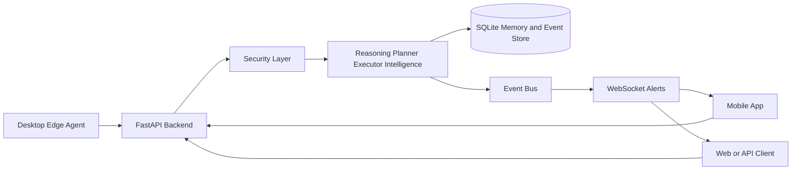
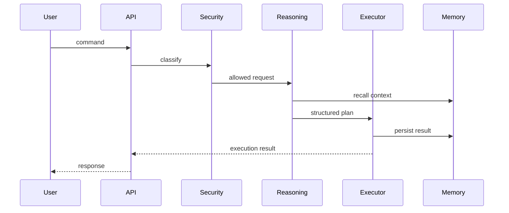
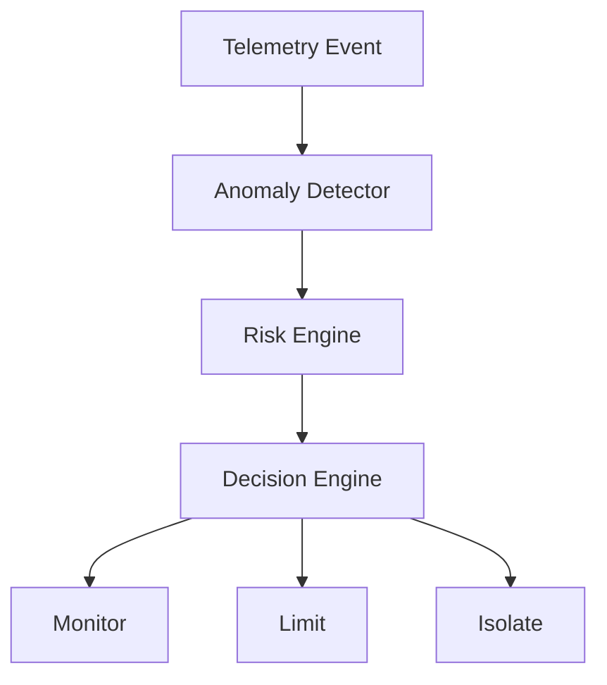
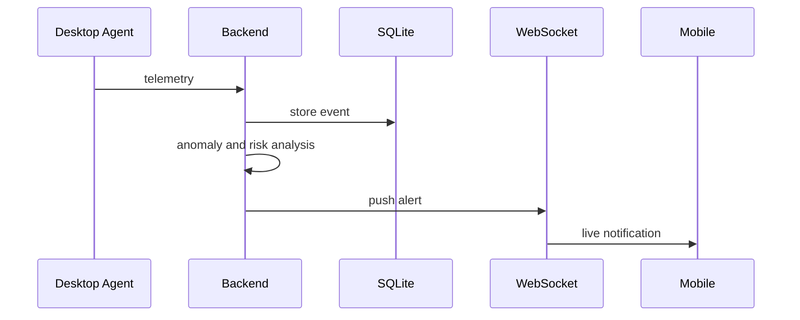

# JARVIS-X Diagrams

## System Architecture

```mermaid
flowchart LR
    Agent[Desktop Edge Agent]
    Mobile[Mobile App]
    Web[Web or API Client]
    API[FastAPI Backend]
    Security[Security Layer]
    Brains[Reasoning Planner Executor Intelligence]
    Memory[(SQLite Memory and Event Store)]
    Bus[Event Bus]
    WS[WebSocket Alerts]

    Agent --> API
    Mobile --> API
    Web --> API
    API --> Security
    Security --> Brains
    Brains --> Memory
    Brains --> Bus
    Bus --> WS
    WS --> Mobile
    WS --> Web
```

## Data Flow

```mermaid
sequenceDiagram
    participant U as User
    participant API as API
    participant S as Security
    participant R as Reasoning
    participant E as Executor
    participant M as Memory

    U->>API: command
    API->>S: classify
    S->>R: allowed request
    R->>M: recall context
    R->>E: structured plan
    E->>M: persist result
    E-->>API: execution result
    API-->>U: response
```

## Decision Pipeline

```mermaid
flowchart TD
    T[Telemetry Event] --> A[Anomaly Detector]
    A --> R[Risk Engine]
    R --> D[Decision Engine]
    D --> O1[Monitor]
    D --> O2[Limit]
    D --> O3[Isolate]
```

## Agent Interaction

```mermaid
sequenceDiagram
    participant AG as Desktop Agent
    participant BE as Backend
    participant DB as SQLite
    participant WS as WebSocket
    participant MO as Mobile

    AG->>BE: telemetry
    BE->>DB: store event
    BE->>BE: anomaly and risk analysis
    BE->>WS: push alert
    WS->>MO: live notification
```
