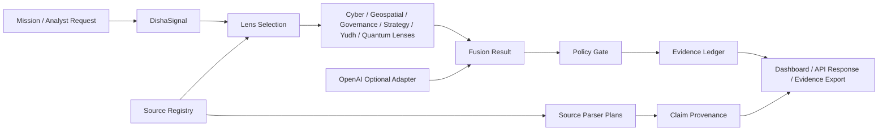

# Architecture

DISHA is architected as one governed mission pipeline, not a collection of disconnected AI demos.

## Active Runtime Layers

1. UI and dashboard: `web/app`
2. API v1: `web/app/api/v1`
3. Contracts: `web/lib/unified/contracts.ts`
4. Orchestrator: `web/lib/unified/orchestrator.ts`
5. Lenses: `web/lib/unified/lenses.ts`
6. Policy gate: `web/lib/unified/policy-gate.ts`
7. Evidence ledger: `web/lib/unified/evidence-ledger.ts`
8. Source registry: `web/lib/unified/source-registry.ts`
9. Source ingestion: `web/lib/unified/source-ingestion.ts`
10. Claim provenance: `web/lib/unified/claim-provenance.ts`
11. Production spine: `web/lib/unified/production-spine.ts`

## Architecture Diagram



## Architecture Rule

No model, parser, legacy module, or dashboard value becomes production unless it passes through:

```text
contract -> policy -> evidence -> test
```

## Archive Boundary

Folders such as `legacy/`, `disha/legacy-root-src`, `disha/ai`, and integration archives are not active production runtime. They are promotion candidates only.
