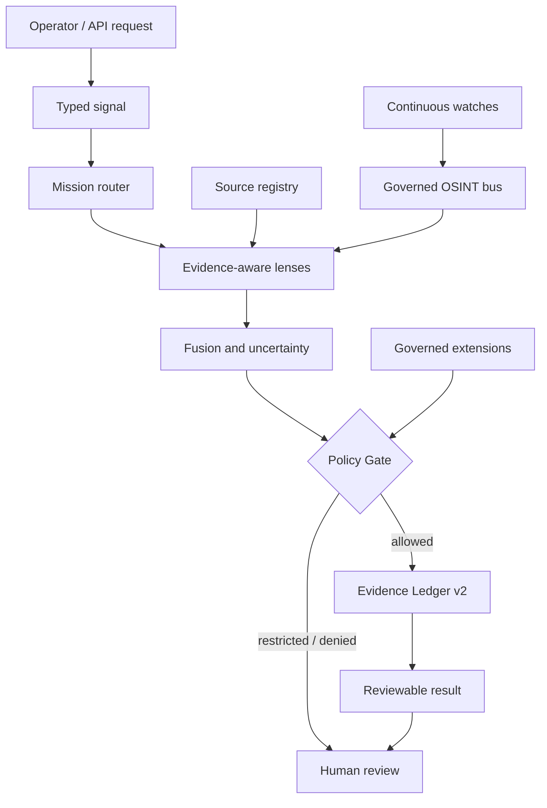

# DISHA Technical Wiki

DISHA is a Constitutional Evidence Operating System for governed intelligence work. This wiki explains what the system is, how the current code is organized, what is already live, and where future capability must pass policy and evidence controls before becoming production behavior.

## 1. What DISHA is

DISHA is not a single OSINT script, chatbot, dashboard, or model wrapper. It is an evidence-first intelligence platform with a governed runtime.

The system is designed around this operating chain:

```text
question -> source routing -> observation -> policy -> evidence -> review -> decision
```

The important design choice is that every stage remains visible. DISHA should be able to explain:

- what the operator asked;
- which source or connector was used;
- what the system observed;
- what the model contributed;
- what policy decided;
- what evidence was written;
- what still needs human verification.

## 2. Why DISHA exists

Modern teams have more tools than governance:

- search engines;
- OSINT directories;
- cyber-intelligence feeds;
- satellite and geospatial platforms;
- public-record datasets;
- LLMs and agent frameworks;
- dashboards and automation scripts.

The hard problem is not collecting more signals. The hard problem is making intelligence reviewable, lawful, source-bound, and useful after scrutiny.

DISHA exists to provide that governed intelligence spine.

## 3. Current deployment topology

```text
User browser
  |
  v
https://disha6.6.thenitishkr.in
  |
  v
Cloudflare Worker route: disha6.6.thenitishkr.in/*
  |
  v
Render web origin: https://disha-v6-web.onrender.com
  |
  v
Next.js DISHA web/API runtime
  |
  v
Optional Python backend: https://disha-v6-brain.onrender.com
```

Important files:

| File | Purpose |
| --- | --- |
| `web/wrangler.jsonc` | Cloudflare Worker route for the custom domain. |
| `web/cloudflare-proxy.ts` | Edge proxy that forwards public-domain traffic to the Render web service. |
| `.github/workflows/edge-smoke.yml` | Verifies the public custom domain, Worker header, and login endpoint behavior. |
| `.github/workflows/cloudflare-edge-deploy.yml` | Deploys the Cloudflare Worker when credentials are configured. |

## 4. Major product surfaces

| Surface | Role |
| --- | --- |
| `/login` | Authenticated product entry. |
| `/dashboard` | Command center for system state, source state, evidence, geography, and readiness. |
| `/workbench` | Mission workflow for source-backed analysis and evidence generation. |
| `/intelligence` | Continuous OSINT and public-source watch surface. |
| `/api/v1/*` | Versioned API for missions, policy, evidence, sources, OSINT, readiness, and extensions. |

## 5. Runtime architecture



## 6. Evidence Ledger v2

Evidence is the product primitive. DISHA should not simply answer a question; it should produce a record that can be inspected later.

Evidence events are designed to include:

- mission identity;
- event ordering;
- payload hash;
- previous event hash;
- event hash;
- source metadata;
- policy state;
- warnings or verification requirements.

This supports tamper-evident chains, exportable records, and analyst review.

## 7. Policy Gate

The Policy Gate is the runtime boundary between technical possibility and allowed system behavior.

DISHA defaults toward denial or review for:

- credential harvesting;
- exploit delivery;
- authentication bypass;
- private-account access;
- leaked-data ingestion;
- uncontrolled identity enumeration;
- active reconnaissance outside a reviewed sandbox;
- unsupported factual claims that look verified.

Policy decisions are not cosmetic. They determine whether a capability can run, whether it must be read-only, whether it is sandboxed, whether human approval is required, or whether it is blocked.

## 8. OSINT / CTI / SPACEINT source universe

The source universe is the broad catalog of investigation and intelligence sources. It includes master directories, OSINT collections, CTI feeds, vulnerability sources, geospatial sources, satellite catalogs, and SPACEINT references.

Current categories include:

- master directories;
- search and archives;
- media verification;
- geolocation;
- conflict and event data;
- corporate and financial records;
- sanctions and public records;
- movement tracking;
- social media research;
- internet scanners;
- malware and IOC feeds;
- domain and infrastructure intelligence;
- breach-exposure references;
- vulnerability intelligence;
- adversary knowledge;
- OSINT frameworks;
- orbital tracking;
- satellite databases;
- Earth observation;
- commercial imagery;
- space policy;
- launch activity;
- space weather.

Every source has a mode:

| Mode | Meaning |
| --- | --- |
| `builtin` | DISHA has a governed live adapter. |
| `connector_ready` | Good candidate for a bounded future adapter. |
| `requires_configuration` | Needs credentials, account, API key, or license review. |
| `reference_only` | Analyst reference or discovery page. |
| `blocked_by_default` | Not executable by the default runtime. |

## 9. Built-in OSINT execution

The governed OSINT adapter bus is passive/public by default.

Current live adapter classes include:

- public DNS;
- certificate transparency;
- RDAP;
- Wayback CDX;
- Common Crawl;
- GDELT;
- CISA KEV;
- GitHub public repository metadata;
- SEC EDGAR;
- OpenAlex;
- World Bank;
- Wikidata;
- official public-source probes;
- dynamic allowlisted public-source adapters.

The bus does not run arbitrary OSINT tools as shell commands.

## 10. Universal OSINT Search

Universal Search classifies a target and chooses allowed adapters.

Examples:

| Target | Expected routing |
| --- | --- |
| Domain | DNS, CT, RDAP, Wayback, Common Crawl, GDELT. |
| IP address | RDAP and public reporting. |
| CVE | CISA KEV and public reporting. |
| GitHub repository | GitHub metadata and public reporting. |
| SEC CIK | SEC EDGAR and public reporting. |
| Entity | Wikidata, OpenAlex, and public reporting. |
| Email / phone / username | Public reporting only; cross-site enumeration remains disabled. |

Endpoint:

```text
GET /api/v1/osint/search?q=<target>
```

## 11. Service connectors

DISHA now has a service connector posture layer for major OSINT and CTI platforms.

| Connector | Status |
| --- | --- |
| OpenCTI | Live-configurable when `OPENCTI_BASE_URL` and `OPENCTI_TOKEN` exist. |
| IntelOwl | Live-configurable when `INTELOWL_BASE_URL` and `INTELOWL_API_KEY` exist. |
| SpiderFoot | Registered but blocked until a reviewed passive-only module allowlist exists. |
| Sherlock | Registered but blocked by identity-enumeration policy. |
| Maigret | Registered but blocked by identity-enumeration policy. |

Endpoint:

```text
GET /api/v1/osint/service-connectors
GET /api/v1/osint/service-connectors?probe=1
```

## 12. Restricted-source governance

Restricted sources such as DDoSecrets, WikiLeaks, Intelligence X, and DeHashed are handled as governance records, not executable ingestion adapters.

Endpoint:

```text
GET /api/v1/osint/restricted-sources
```

The endpoint may show approval/configuration posture, but it must not fetch, store, mirror, search, or return:

- breach rows;
- passwords;
- tokens;
- secrets;
- private keys;
- private personal records;
- credential dumps;
- leaked datasets.

## 13. Key API routes

| Route | Purpose |
| --- | --- |
| `GET /api/v1/health` | Runtime health. |
| `POST /api/v1/mission` | Governed mission execution. |
| `POST /api/v1/agentic/mission` | Agentic mission flow. |
| `POST /api/v1/policy/evaluate` | Policy decision. |
| `GET /api/v1/evidence/{missionId}` | Mission evidence. |
| `POST /api/v1/evidence/export` | Evidence export. |
| `GET /api/v1/sources/registry` | Source registry. |
| `POST /api/v1/sources/probe` | Source probe. |
| `GET /api/v1/osint/catalog` | Adapter and source catalog. |
| `GET /api/v1/osint/search` | Universal governed OSINT search. |
| `GET /api/v1/osint/sources` | Search source universe. |
| `GET /api/v1/osint/watches` | List watches. |
| `POST /api/v1/osint/watches` | Create watch. |
| `POST /api/v1/osint/watch-bundles` | Create bundle. |
| `GET /api/v1/extensions` | Extension registry. |
| `GET /api/v1/production/readiness` | Production readiness posture. |

## 14. Repository map

| Path | Responsibility |
| --- | --- |
| `web/app/` | Product surfaces and API routes. |
| `web/lib/unified/` | Core contracts, policy, evidence, mission flow, OSINT, service connectors, source universe. |
| `web/lib/extensions/` | Governed extension adapters. |
| `web/components/` | UI components. |
| `web/database/` | Database migrations and persistence schemas. |
| `web/tests/` | Product regression tests. |
| `disha/brain/` | Python Brain runtime. |
| `skills/vyuha-defense-engine/` | Defensive-intelligence source package. |
| `docs/osint/` | Governed OSINT documentation. |
| `docs/wiki/` | This technical wiki. |
| `.github/workflows/` | CI, CodeQL, DB migration verification, Cloudflare deploy, custom-domain smoke. |

## 15. Development workflow

Install and run:

```bash
npm install --prefix web
npm --prefix web run dev
```

Verify:

```bash
npm --prefix web run type-check:full
npm --prefix web test
npm --prefix web run build
```

Python verification:

```bash
python -m pip install -r disha/brain/requirements.txt pytest
python -m pytest tests/test_disha_brain_graph.py skills/vyuha-defense-engine/tests
```

Docker:

```bash
docker compose up --build web
```

## 16. Promotion rule for new capability

New capability must pass:

```text
contract -> policy -> evidence -> tests -> documentation
```

A tool is not production-ready because it is famous, open source, or included in an awesome list. It becomes production-ready only when DISHA has reviewed its purpose, license, source behavior, policy outcome, runtime limits, evidence output, and tests.

## 17. Current engineering posture

Working:

- web product shell;
- mission API paths;
- Evidence Ledger v2;
- policy gate;
- governed OSINT adapter bus;
- Universal OSINT Search;
- continuous watches;
- source universe;
- restricted-source governance;
- service connector posture;
- Cloudflare custom-domain smoke;
- Render deployment model.

Still hardening:

- full durable case lifecycle;
- richer approvals and review workflows;
- production identity posture;
- disaster recovery;
- deeper observability;
- tenant governance;
- geospatial dataset completeness;
- source-specific parsers for more cataloged sources.

## 18. Maintainer note

DISHA should be documented with the same discipline as it is built: no hidden overclaiming, no unsafe capability laundering, no confusing cataloged sources with executable sources, and no treating model output as evidence.

The product earns trust by being explicit about its boundaries.
